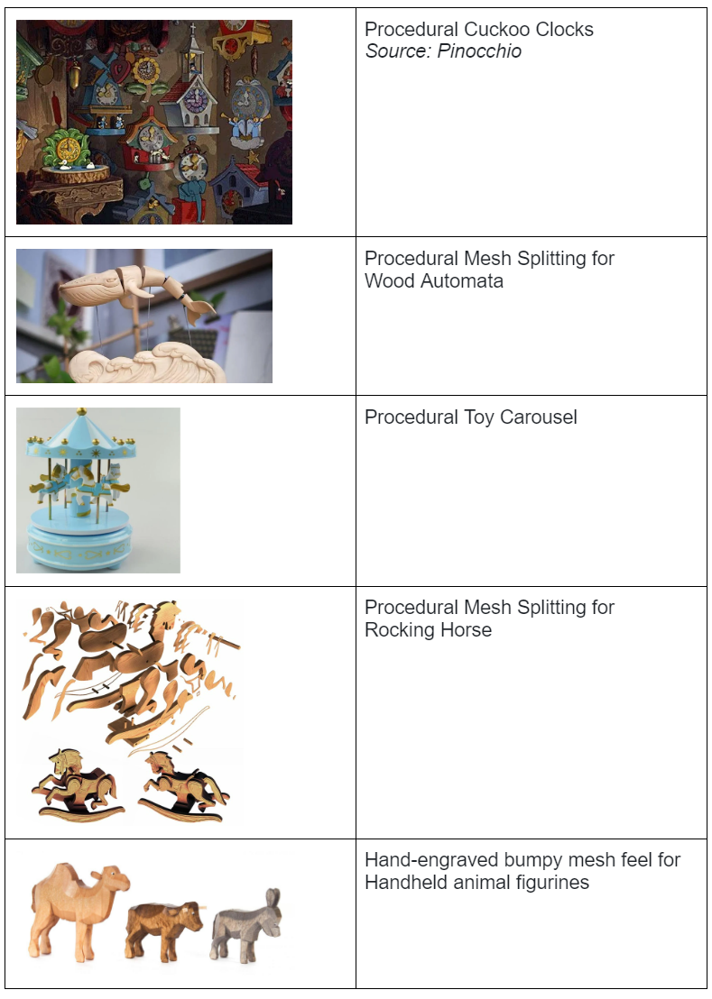
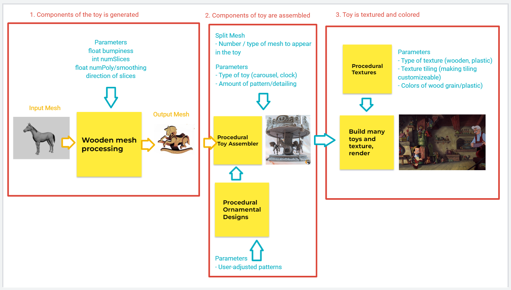

# Laugh Out Loud's Handmade Toy Co.
### Est 2023, by Liu, Ouyang, Lu

## Introduction: Wooden Toy Generator

* We are interested in procedural tool development for artists, as well as algorithmic mesh manipulation. 
* In exploring wooden toys, we have to solve such problems, including slicing mesh to become wooden figures, and creating user–customizable tools that produce stylized objects. 

## Goal

* Create customizable tools to generate wooden toys. 
    * The tools will allow for artistic input, giving the user ability to create various different versions of the toy type to create a cohesive collection 
* Stretch goal: rendered image of a toy workshop, including a setup of each of our tools 

## Inspiration/reference:

* Inspired by Gepetto’s wood toy workshop in Pinocchio, we wanted to create tools to generate charming handmade-style wood toys. 
* We had the following ideas for what types of toys to generate and how we would go about it:

## Specification:

* Procedural Toy Meshifier
    * Input: mesh | Output: vertex deformed-mesh
    * Slices the mesh into stacked wooden panels (see mesh cutting image above)
    * Variables:
        * Simplification of mesh 
        * Number of sliced layers
    * Possible Resources: Cardboard slice generator
    * Makes it look hand/wood-carved
    * Variables: 
        * Simplification of mesh 
        * “Bumpiness” of carve

* Procedural toy generator
    * For cuckoo clocks, carousels, automata 
    * Generating the customizable base mesh
    * Generating ornamental patterns / details on the surface of the mesh
    * Animation and movement 

* Procedural Textures – stylized, hand/wood-carved look
    * Wood textures
    * Plastic textures

## Techniques:

* We’ll mainly be using VEX and node networks in Houdini. 
* For procedural textures, we plan to learn the Adobe Substance Suite

## Design:

## Timeline:

* Milestone 1: Untextured but assembled toy with basic embellishments
    * Diana: 
        * Develop tool for slicing / flattening given mesh to be used for wooden figures
    * Claire: 
        * Develop tool for creating embellishments / ornamental designs that can be customized and wrapped onto primitive mesh 
            * Inspiration: Procedural Lamp (https://www.youtube.com/watch?v=hGeoPErJ448&t=1s)
    * Yuhan: 
        * Develop tool for base of toy (carousel or cuckoo clocks?) that is user-customizable
     
* Milestone 2: Adding textures, UI & user control improvements
    * Diana: 
        * Allow users more granularity on mesh transformation (isolate eyes as their own layer, etc?)
    * Claire: 
        * Begin working on procedural textures (wood polished, wood bark, wood painted, plastic) in Substance 
    * Yuhan:
        * Combine three tools from Milestone one to create Houdini user-friendly subnetwork that creates one type of toy 

* Milestone 3: Use of tool for “cute lil rendered image”
    * Diana: 
        * Tweak parameterization of slicing/mesh flattening
    * Claire: 
        * Develop secondary tool for a different type of toy 
    * Yuhan: 
        * Work on rendered image in Unreal or Unity, showcasing toy variations and textures 
