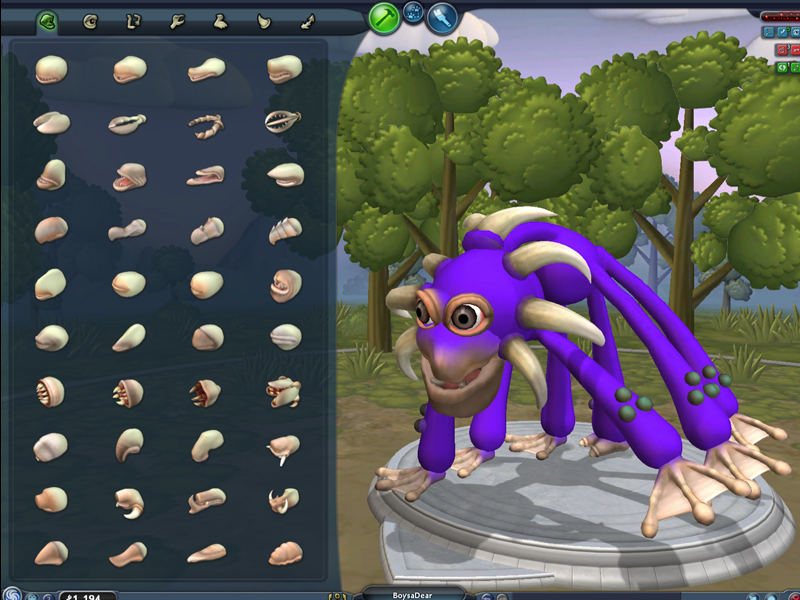
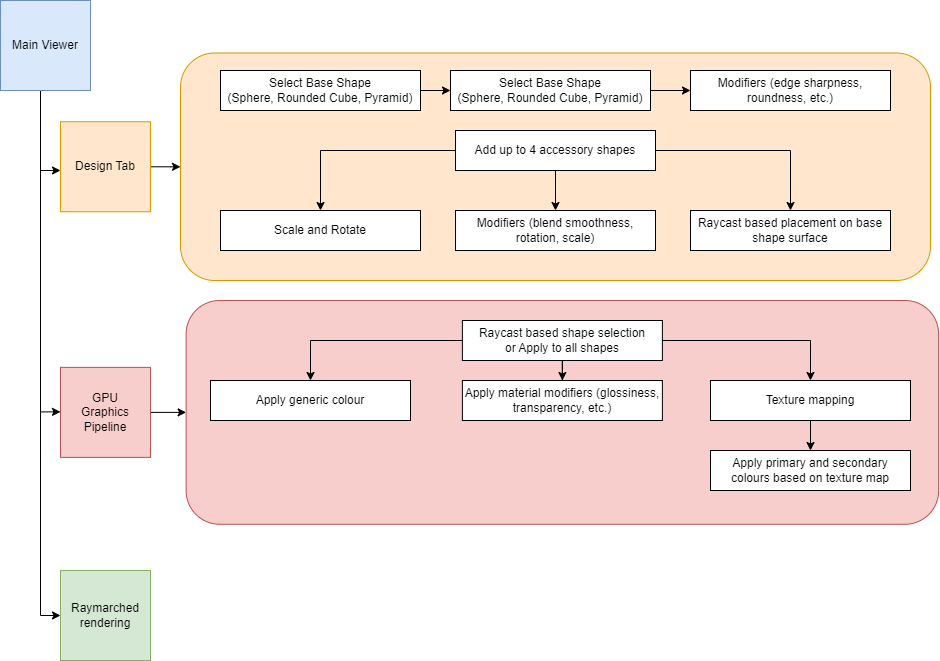
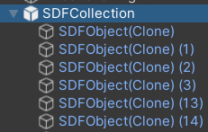
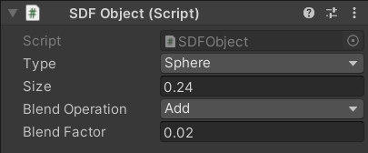

# Character Creator

# Table of Contents

- [Design Doc](#design-doc)
  - [Introduction](#introduction)
  - [Goal](#goal)
  - [Inspiration](#inspiration)
  - [Specifications](#specifications)
  - [Techniques](#techniques)
  - [Design](#design)
  - [Timeline](#timeline)
- [Milestone #1: Setup SDFs and Raymarching (11/15/23)](#milestone-1-setup-sdfs-and-raymarching-111523)
- [Implementation Details](#implementation-details)
  - [1. Raymarch shader](#1-raymarch-shader)
  - [2. Lighting and Shading](#2-lighting-and-shading)
  - [3. Animations ???](#3-animations-)
- [References](#references)

# Design Doc

## Introduction

This project will serve as a base for a procedural character creation system that could hopefully be integrated into my game,
[Fling to the Finish](https://store.steampowered.com/app/1054430/Fling_to_the_Finish/), in the future. The game uses an art-style where all characters fit within a bounding-sphere, and must be *roughly* round shaped.

## Goal

A tool made in Unity that allows the user to create roughly spherical characters by using smooth (or hard) blended SDFs and a procedural texturing tool for the generated characters. This tool will allow the user to choose from a bunch of predefined metaball primitive shapes and combine them to make a character. The user will be able to procedurally texture the generated character. Both the geometry and texturing stages will allow the user to tweak parameters to customise the look of their character.

## Inspiration

[Spore](https://store.steampowered.com/app/17390/SPORE/) uses a signed distance field (SDF) (more specifically, metaballs) based approach for its extremely robust character creation engine. While this engine is ahead of its time and really technologically complex, I wish to create a tool that could replicate a small chunk of its functionality.

|Spore Character Creator|
|:-:|
||

Most of this will be achieved by referencing [IQ's amazing articles](https://iquilezles.org/articles/) on SDFs, raymarching and procedural texturing of SDFs.

The hope is to create a tool for quick creation of spherical characters that would fit the aesthetic of Fling to the Finish.

|Fling to the Finish Characters|
|:-:|
||

## Specifications

**1. Primitive Metaball based character generator**

This system will use a number of predefined metaballs including:

- a base body shape (sphere, rounded cube, pyramid)
- optional accessories, including
  - eyes, mouth and nose
  - wings
  - visual enhancements, such as a torus

The user will be allowed to first select a base body shape, and then add up to 4 accessories, by moving, rotating, and scaling them in 3D space near the main body metaball.

**2. Raymarching in Unity**

Since the system will use metaballs, it needs a raymarching algorithm to render these metaballs. This will be implemented as a HLSL shader in Unity.

**3. Procedural Texturing**

This will allow the user to colour each part of the generated character based on chosen parameters:
  - shading model (lambertian/phong/PBR)
  - colour and glossiness
  - applying procedural textures on to the shape based on a spherical projection (more explained later)

**Stretch goals:**

**1. Apply different stylized effects for texturing**

Instead of simply rendering the mesh, allow the user to generate a stylized character (toon shaded, pixelated, etc.)

**2. Generated character to mesh conversion, with automated UV mapping and texture projection**

This is required for use in a traditional rasterized pipeline, which is what most games, including Fling to the Finish, use. Since this is not the main focus of the project, this will be a stretch goal based on the progress of the project.

## Techniques

- **Unity Engine** will be used for the development of this tool.
- [SDFs / metaballs](https://iquilezles.org/articles/raymarchingdf/) for character body parts generation, adjustment, and rendering.
- For procedurally texturing based on predefined texture maps, the texture maps will be projected on to a sphere similar to [these PBRT approaches](https://www.pbr-book.org/3ed-2018/Monte_Carlo_Integration/2D_Sampling_with_Multidimensional_Transformations), and then projected on to the generated character based on its surface normals. This approach is rather naive, but will serve as a good starting point.

## Design

||
|:-:|

## Timeline

- **Week 1 | Milestone 1 (11/15)**
  - Setup raymarching in Unity
  - Create basic SDF shapes
  - Setup moving and combining multiple SDF shapes using smooth and hard blending options
- **Week 2 | Milestone 2**
  - Finish moving, rotating and scaling of different SDF shapes
  - Allow multiple types of blending based on a smoothed interpolation between smooth and hard blending
    - Based on preset AnimationCurves (stretch goal: allow user to manipulate these curves)
- **Week 3 | Milestone 3 (11/27)**
  - Create UI for texturing individual primitives
    - Lambertian shading model
    - Phong shading and reflections
  - Texture mapping based on spherical projection
- **Week 4 | Final (12/5)**
  - Improve UI of the tool
  - Improve visual fidelity
  - Final tweaking and adjustments of visual parameters

# Milestone #1: Setup SDFs and Raymarching (11/15/23)


I hit pretty much most of my goals for Milestone 1, which is awesome! In summary, I have created the following systems:

- `SDFObject` MonoBehaviour
  - Data holder for describing an SDF object's properties
    - `Type` - the shape of the object (Sphere and Cube implemented)
    - `Size` - scale of the object
    - `Blend Operation` - Add (Union), Subtract, or Intersect
    - `Blend Factor` - Strength of the blending (currently only works with Add mode, but will make it work with the other two blend operations in future milestones)
- `SDFCollection` MonoBehaviour
  - Contains multiple `SDFObject` children
  - Renders all its children in the heirarchy that lie inside an axis-aligned bounding box
  - Children blend with their siblings based on their order in the heirarchy. This ordering can be restructured anytime to update how the children are blended together.
  - Transfers data from its children into the Raymarching shader
- `Raymarch` Shader
  - Simple unlit shader that performs raymarched rendering of the scene
  - Potential to improve performance by shifting scene SDF calculation to a compute shader (stretch goal)

|SDFCollection|SDFObject|
|:-:|:-:|
|||

|Character creation process|
|:-:|


https://github.com/utkarshdwivedi3997/character-creator/assets/22533563/a13740c8-93d7-497b-a462-8231ef2bc678


# Implementation Details

## 1. Raymarch shader

This is a rather simple shader that performs raymarching on a collection of `SDFObject`s. The material created from this shader is attached to the `SDFCollection` object that holds all the `SDFObject`s. The `SDFCollection` object has a `MeshRenderer` component which renders a Unity cube. The Raymarch shader is a fragment shader that renders this cube and shows SDFs inside of it.

The actual raymarching is a very standard [sphere tracing algorithm](https://jamie-wong.com/2016/07/15/ray-marching-signed-distance-functions/) that runs for `n` iterations and a maximum distance `max_dist` over all the objects in the `SDFCollection`. Each `SDFObject`s individual SDF is calculated and blended with the `SDFCollection` SDF based on the blend operation specified by it.

Data from the `SDFCollection` is transferred into the shader at each frame in an `Update` call using a `MaterialPropertyBlock`. I learned this trick from [this article](https://bronsonzgeb.com/index.php/2021/03/06/particle-metaballs-in-unity-using-urp-and-shader-graph-part-2/) on rendering particles as metaballs. It looks something like this:

```C#
[RequireComponent(typeof(MeshRenderer))]
public class SDFCollection: MonoBehaviour
{
  private Renderer renderer;
  private MaterialPropertyBlock materialPropertyBlock;

  private static readonly int SDFPositionsShaderPropertyID= Shader.PropertyToID("SDFPositions");     // handle pointing to the SDFPositions array in the shader
  private Vector4[] sdfPositions;   // array that will contain all SDFObject children positions

  ... // more properties
  
  private void Initialize()
  {
    renderer = GetComponent<Renderer>();
    materialPropertyBlock = new MaterialPropertyBlock();
  }

  ... // code

  private void Update()
  {
    sdfPositions = // update sdfPositions if they have moved

    materialPropertyBlock.SetVectorArray(SDFPositionsShaderPropertyID, sdfPositions);

    ... // Add more properties to the material property block

    // send this data to the shader
    renderer.SetPropertyBlock(materialPropertyBlock);
  }
}
```

In the HLSL shader, this can simply be read by declaring an array:

```HLSL
#define MAX_SDF_OBJECTS 256
float4 SDFPositions[MAX_SDF_OBJECTS];
```

These SDFPositions are then used in the shader to calculate each `SDFObject`'s SDF and blend it with the overall `SDFCollection`.

## 2. Lighting and Shading

I was able to get the basic setup done fairly quickly, so I got a head start on milestone 2's shading feature. There is a very basic Lambertian shading model that affects the SDFs. Admittedly, as simple as this code is, I spent 3 days debugging one very tiny and pesky bug in my shader code that was incorrectly calculating the normals:

```HLSL
float GetNormal(float3 pos)
{
  return normalize(float3(gradient of SDF at pos)) // normal code
}
```

There was nothing wrong in the actual normal calculation, and it drove me crazy! I referenced 6 different articles on normal calculation for SDFs, including a project that handles SDF rendering in Unity, and they all did the exact same thing I did. Eventually I asked my friend Saksham to help debug the issue, and - to my extreme embarassment and frustration - found that my function declaration was incorrect and should have been:

```HLSL
float3 GetNormal(float3 pos)
{
  return normalize(float3(gradient of SDF at pos)) // normal code
}
```

The return type was incorrect and was simply chopping of the `normal.yz` components of the normal vector! I wish Unity had errors (or at least warnings!) notifying you that you're trying to return a `float3` in a function that returns a single `float`.

## 3. Animations ???

This is not a feature I implemented, rather something that worked simply because of the way SDFs work and how awesome Unity is. Just as a fun experiment, I made a Unity animation and keyframed each `SDFObject` of the character I made to different positions. This works because the SDFs can move and update the shader in real-time! What's even more satisfying is the fact that any inspector-exposed variable in the SDFObject can be keyframed. This is how I made the character's mouth open and close: its size value is animated.

# References

- Adam Mally's course slides from CIS 560 and CIS 561 at University of Pennsylvania
- [IQ's awesome articles on SDFs](https://iquilezles.org/articles/)
- [Ray marching article](https://jamie-wong.com/2016/07/15/ray-marching-signed-distance-functions/)
- [Particle metaballs in Unity](https://bronsonzgeb.com/index.php/2021/03/06/particle-metaballs-in-unity-using-urp-and-shader-graph-part-2/)
- [Spore](https://store.steampowered.com/app/17390/SPORE/)
- [Fling to the Finish](https://store.steampowered.com/app/1054430/Fling_to_the_Finish/)
