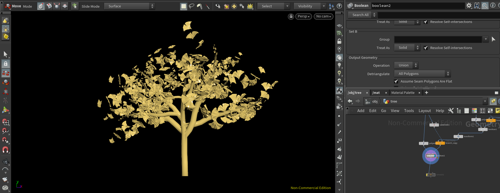
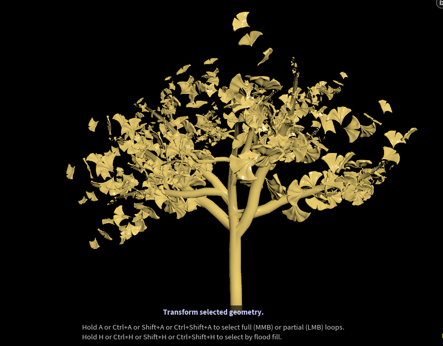
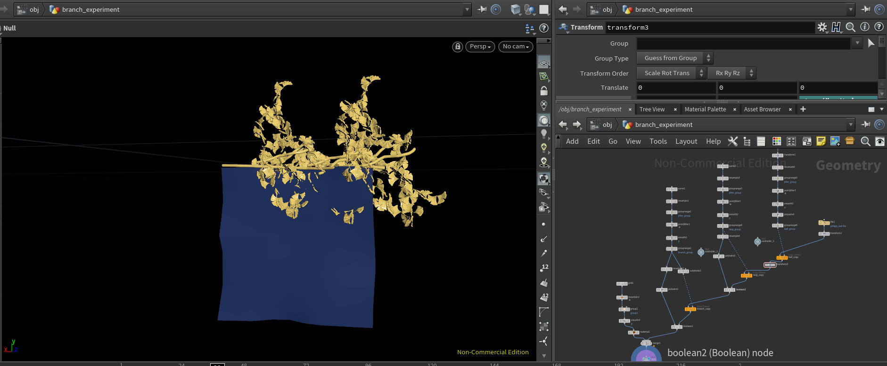
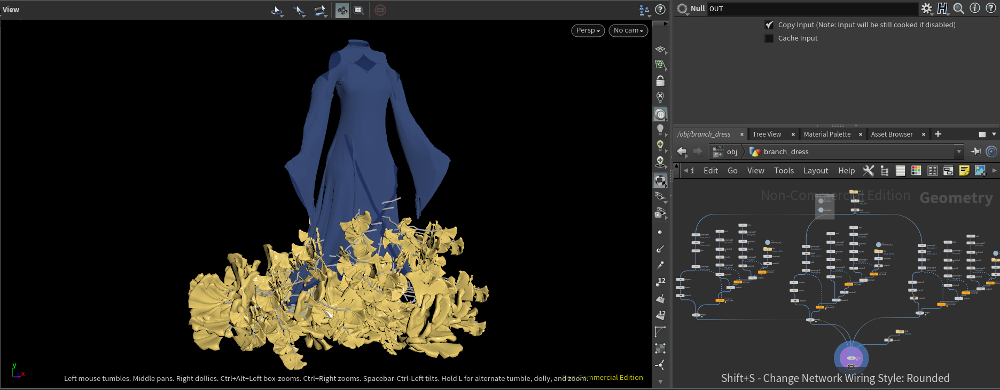
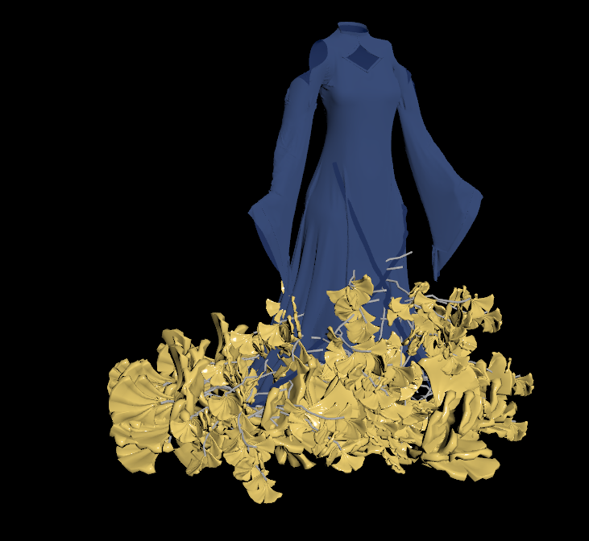
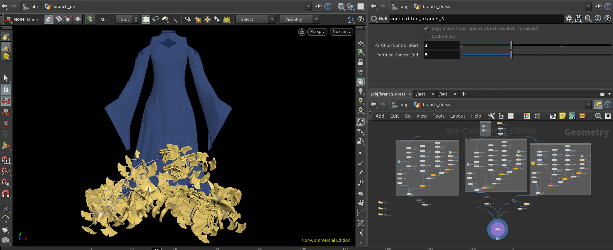
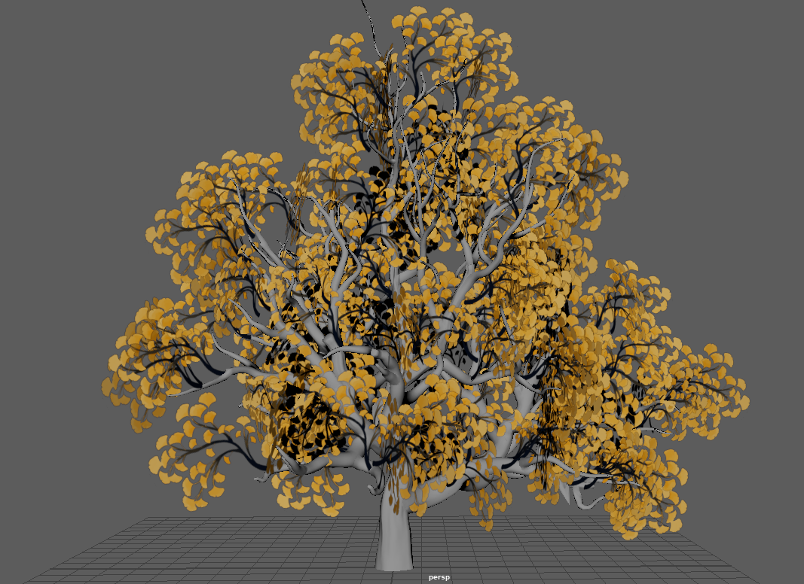
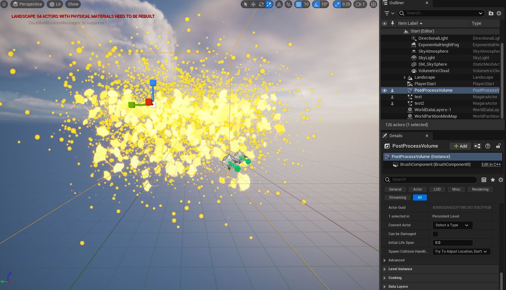
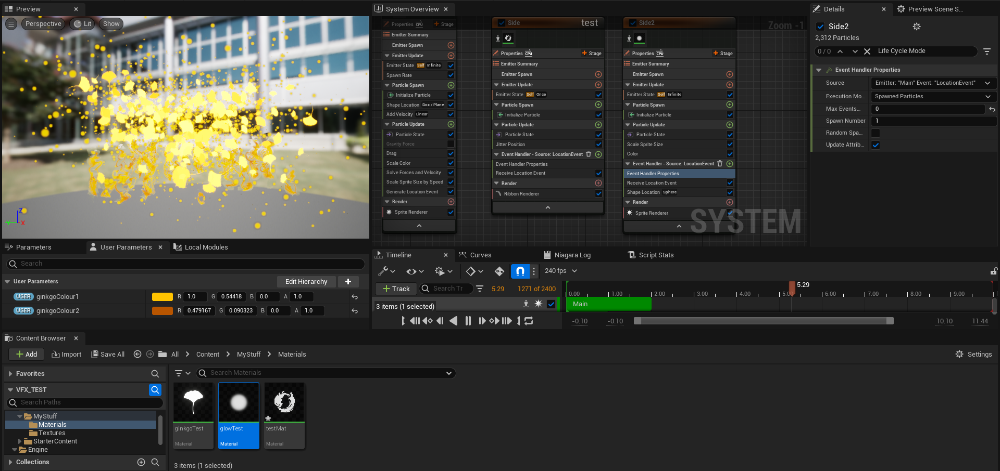

# CIS 5660 Final Project

[https://youtu.be/oI4D4JgaK6Q](https://youtu.be/oI4D4JgaK6Q)

#### Introduction
We were inspired to create this character by the various beautiful visuals of our favorite video game characters. 

#### Goal
Create a render of a ginkgo-themed character using a mixture of procedurally and manually modeled assets, procedurally-created textures, and procedural effects of ginkgo leaves falling off the dress. 

#### Inspiration/reference:
Design is based on a combination of traditional chinese clothing and fantastical elements. Inspired by Mihoyo’s Honkai Impact 3rd character designs.

(Original design by Jackie Li)

#### Specification:
- Manually modeled in Maya: hair decorations, clips, pins, shoes
- Manually modeled in ZBrush: figure, hair
- Manually modeled in Marvelous Designer: dress
- Procedurally modeled in Houdini: ginkgo leaves on bottom of dress/ sleeves
- Procedurally textured in Substance Designer/Painter: dress fabric textiles
- Cel-shaded in Unreal: hair, skin
- Unreal particle sim: effects of leaves falling off dress

#### Techniques:
For ginkgo branch: 
- Houdini VEX and Node systems
- L-systems

Texturing: 
- Cel-shading/ bucketing
- Vertex painting (lerp) for blending between materials on a mesh

Unreal Engine:
- Shaders (Post processing and surface)
- Particle Simulation

#### Design:

#### Timeline:
11/15: 
- Finish geometry and UV-unwrapping for all hand-modeled assets
  - Figure, hair
  - Dress
  - Props (hair deco, clips, pins, shoes)
- Start spline-based ginkgo branch generator in Houdini

11/27: 
- Complete a working ginkgo branch generator
- Create fabric textiles
- Unreal particle sim for falling ginkgo leaves
- Merge all elements together in UE5 (Preliminary)
- Create cel-shaded materials for skin and hair

12/5: 
- Refine and reimport various elements as needed
- Polish final image
  - Lighting
  - Background
  - Post process shaders

# Milestone 1 Updates

#### Accomplishments
- Modelled the head, body, and hair for our character.
- Finished modelling embellishments for character.
  - Hairpins, Shoes, Dress designs, etc.

 ##### Maya Modelling
 
|  |
|:--:|
|Body, hair, and head model.|

|  |
|:--:|
|Shoes model.|

|  |  |  |
|:--:|:--:|:--:|
|Pin Model 1|Pin Model 2|Pin Model 3|

|  |  |
|:--:|:--:|
|Ginkgo Clips|Ginkgo Ornament|

- Started on procedural generator for the branches. Plan to watch tutorials to create a branch generator, get only the endpoints of the branches, and adding leaves on there.
  - That will probably be the more difficult part for me to figure out, since I already have been having trouble trying to figure out how to parametrise my tool.
  - I am also simultaneously trying to figure out how to map a spline onto a mesh, since that will be where the procedural branch generator starts to grow.

##### Houdini Procedural Generator

# Milestone 2 Updates

#### Accomplishments
- Completed and refining procedural ginkgo generation tool.
  - Including finding a way to integrate tool with the cloth simulation of the dress.
  - Currently finding a way to better organise the ginkgo leaves, which will require much tooling around with random values.
- Completed Substance Designer procedural texture for the dress.
- Completed Marvellous Designer dress simulation.
- Started setting up project in Unreal Engine.

##### Procedural Ginkgo Leaf Tool

###### First iteration

|  |  |
| :--: | :--: |
|Following a tutorial to create a tree.|Ginkgo tree asset.|

###### Second iteration

|  |
| :--: |
|Manually creating a bezier curve at the border of a grid to simulate replicating the tool on a cloth simulation.|

###### Third iteration
|  |  |
| :--: | :--: |
|Extracted the borders of the dress as a bezier curve to grow branches with leaves.|Final product mockup. Will be adding more to sleeves and playing with values within the next update.|

##### Procedural Substance Designer Texture
|  | 
|  |
| :--: |
|Created procedural ginkgo leaf mask in Substance Designer. Experimented with using this to create a pbr fabric textile material. 

##### Unreal Engine Setup
|  |
|  |
| :--: |
|Imported and placed all meshes. Set up and assigned simple cel-shaded materials for all meshes. Used ginkgo leaf mask to create simple cel-shaded fabric textile material.|

# Milestone 3 Updates

##### Sculpted Hair

| :--: |
|Sculpted hair in ZBrush.|

##### Refined Procedural Ginkgo Leaf Tool

Refined numbers and rotations for each of the procedural meshes that the tool outputs. Also added some controllers for ease of use.

||
| :--: |
|Complete shot of the procedural ginkgo leaf tool.|

##### Enhanced Toon Shaders

Set up vertex painting for blending between materials. This was done through a simple linear interpolation node in the material graph. Also added specular highlights to the jade material using the Blinn-Phong shading model. 

##### Simple Landscape

Sculpted a simple landscape in Maya. Created grass card opacity mask by baking a grass mesh onto a plane in Substance Designer. Grass color was set in the toon shader in the same way as all other materials. Used Unreal foliage tool to create a new grass foliage type and apply grass to landscape.

##### Tree

Procedurally created tree branches and trunk in Houdini. Hand-painted branch/leaf texture and created opacity mask in Procreate. 
||
| :--: |
|Created the branches in Houdini using procedural tree node. Hand drew textures for ginkgo leaf branches and placed them all over tree in the form of image planes.|

##### Falling Ginkgo Leaf Particle Sim

Created particle simulation out of Unreal Engine 5's Niagara Particle System. Ported a custom texture for the particles, attached a ribbon renderer and extra sprite renderer for additional effects. 

|||
| :--: | :--: |
|The particle simulation as viewed in the main Unreal viewport.|The particle simulation asset. As one can observe, there are three emitters that control the simulation's main particles and additional effects.|

##### Setup Cameras & Rendered Videos/Shots

Set up several cinematic cameras to get close-up and overall shots. Used Unreal level sequencer to create key-framed camera pans.

