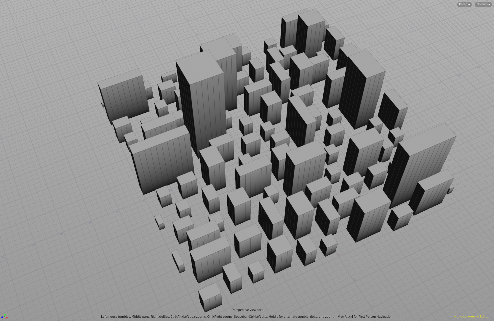
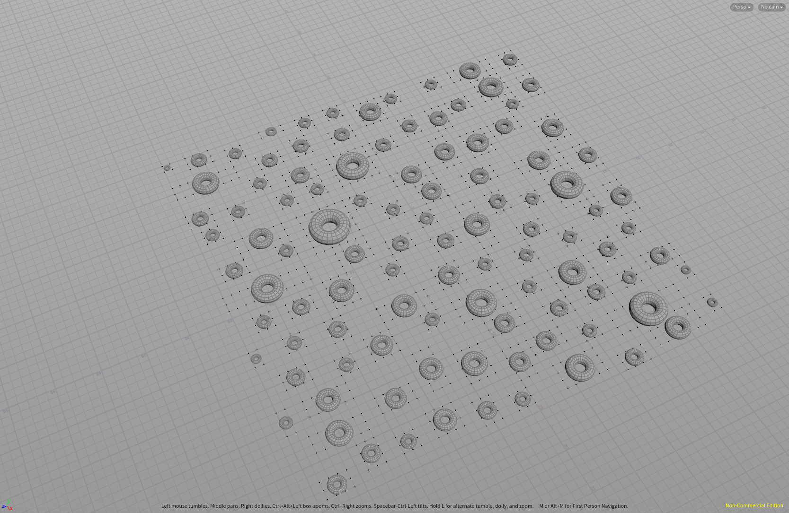
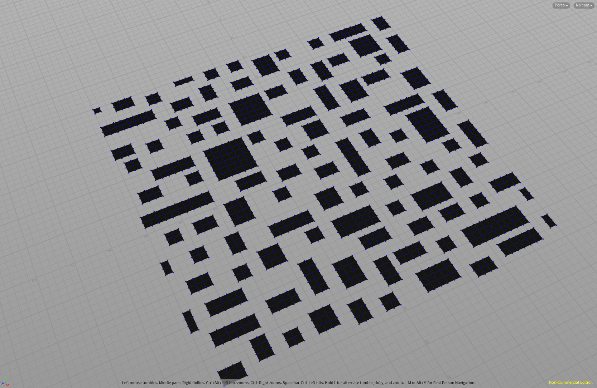
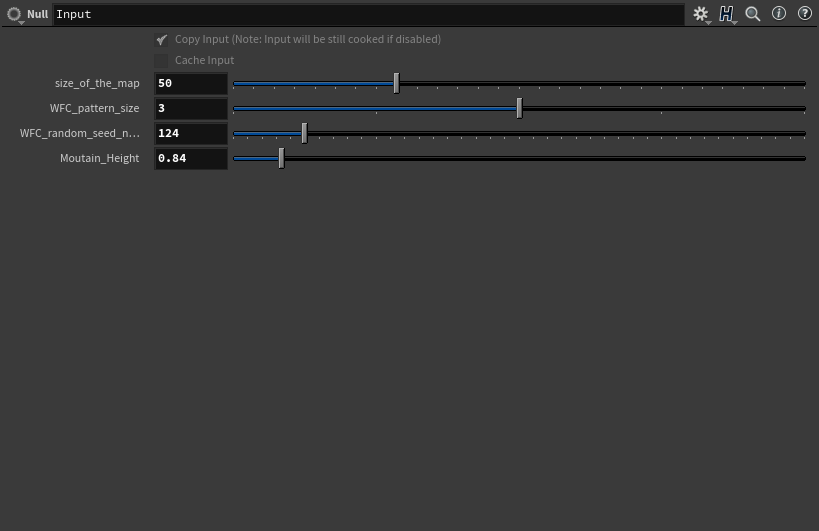
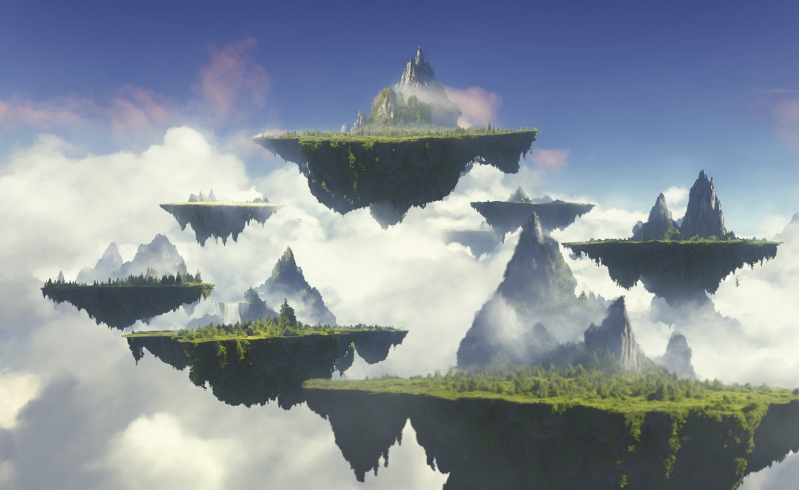
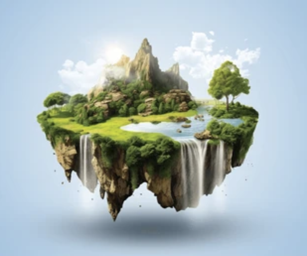
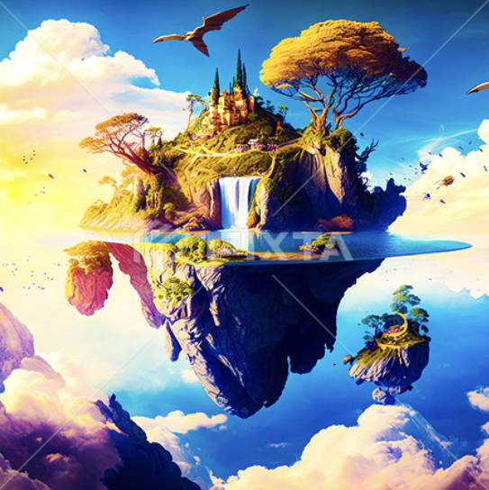

# Islands Generation

Members: Xiaoxiao(Crystal) Zou, Keyu Lu, Ruijun(Daniel) Zhong

## Milestone 2

  
 Specifications 

  ## Milestone 2 Progress Report

### Integration and Optimization

The second milestone in our project marked significant progress, building on the foundational work accomplished in Milestone 1. Our focus was on merging the individual elements - the island, the cloud, and the island map - into a cohesive and visually stunning environment. 

Key developments included the procedural generation of islands based on the map created in Milestone 1. This step was crucial in bringing a sense of realism and diversity to the island shapes and formations. The clouds, were also procedurally generated, adding an additional layer of depth and realism to the environment. We also modified the cloud density and incorporating lighting effects to enhance the visual impact.

However, we encountered a challenge with Houdini's long loading times, likely due to the complexity of our objects. To address this, we made the tough decision to remove certain elements, such as vines and grass on the islands, to facilitate smoother rendering. This optimization was necessary to maintain the project's momentum and ensure that we could effectively integrate and render the merged elements. We will try to tackle this limitation in for the final project presentation.

### Exploration and Planning for Advanced Features

In addition to the integration work, we explored additional features to enrich our environment. We looked into Houdini plugins for Unity, which could potentially offer new avenues for integrating our procedural elements into a more interactive platform. Furthermore, we are planning to incorporate a bird flocking Unity asset into our current procedural island setup. This addition is expected to add a dynamic and lifelike element to our islands, enhancing the overall immersive experience.

### Reflection and Future Directions

This milestone was not only about technical advancement but also about learning to balance ambition with feasibility. The removal of certain elements, while a compromise, taught us the importance of flexibility and adaptability in complex projects. As we move forward, our focus will be on polishing these integrated elements and ensuring seamless functionality within Unity for our final demonstration.

Our journey continues with the shared goal of creating a visually captivating procedural island environment and we are excited to see how our project evolves in the next phase.
  
  

## Milestone 1

  
 Specifications 

  
  ## Island Object Generation (Crystal Zou)
  ### Objective:
  The primary goal of Milestone 1 was to craft a realistic and visually captivating island environment in Houdini. This involved a series of intricate procedures aimed at simulating natural terrain and elements.
  Below is the rendered image of the island with vines: 
  
  
  ### Implementation:
  The journey began with the creation of the main island. Here, I employed node point jitter to shape the terrain, followed by a refinement of node displays for enhanced visualization. To bring the main island to fruition, I employed a color gradient, utilizing it to drive mesh displacement, thereby laying down a foundation for the subsequent stages.

  The process then moved to the construction of a Druid Stone Circle, a task that allowed me to delve into the Houdini boolean tools. These tools facilitated complex operations including carving and merging geometries. The placement of the stones was achieved through the strategic use of a copy stamp node, pivotal for imparting a randomized yet coherent appearance to each stone. This phase included the arrangement of stones in a grid circle pattern, crafting a basic stone box shape, and applying boolean operations. The process was further refined by subdividing nodes, adjusting transform modes, adding surface noise, and incorporating elements of randomness to infuse the circle with a touch of authenticity and depth.

  Next, I focused on crafting a small stone wall that would gracefully trace along a curve.The key step in this process was the alignment of the normals with the curve, ensuring a natural flow and contouring of the wall. I achieved the desired randomization through the strategic use of a Group Expression node, complemented by a series of adjustments in the viewport, curve type modifications, segment length fine-tuning, jitter settings optimization, and precise definition of curve tangents. The culmination of these efforts was a stone wall that was not only randomized in its placement but also perfectly attuned to the island's topography.

  The final task in this milestone was the creation of vines. Initially, I experimented with a scatter node and a foreach loop, seeking a method that offered precise control and intricate detailing. However, encountering challenges with this approach, I transitioned to a hair simulation method, which proved to be a more effective and efficient solution. This successful implementation, however, is not the end of the journey. I am committed to revisiting and refining the initial foreach loop method, aiming to further perfect this technique in future project iterations for more realistic effect.

  ## Cloud Simulation (Keyu Lu)
  ### Objective:
  The primary objective of this milestone was to develop a dynamic cloud simulation that realistically mimics the movement, merging, and interaction of clouds in a natural environment.
  
  ### Approach and Technologies Used:
  To achieve this, I employed  Houdini metaball to simulate the dynamic behavior of clouds. This method allowed for the creation of clouds that not only move fluidly but also interact with each other in a natural way, such as merging or bouncing off each other.
  
  ### Fine-Tuning Details:
  **Mountain Noise Integration**: To add a touch of realism, I incorporated mountain noise node. This addition helps in simulating how clouds interact with mountainous terrain, effectively changing their shape and movement patterns.
  **Cloud Noise Enhancement**: To further refine the cloud's appearance, I added Houdini cloud noise. This ensures that each cloud has a unique, lifelike texture, enhancing the overall visual appeal.
  
  ### Demonstration and Insights:
  To showcase the results of this milestone, a demo video is provided below. The video highlights the dynamic cloud simulation in action, showcasing the realistic movement and interactions of the clouds. It offers a glimpse into the intricate details and the level of realism achieved through the combination of metaballs, noise algorithms, and Houdini's advanced capabilities.

  **Click on the Image below to checkout the demo video, or [watch it here](https://vimeo.com/884540553):** 
  

  # Island Map Generation (Ruijun(Daniel) Zhong)
  ### Objective:
  The objective is to create a randomly generated map with unique island shapes and sizes, utilizing the wave function collapse method. The core concept is to generate a map pattern where each island's characteristics are determined by the underlying pattern.
  
  
  ### implementation:
  To begin, I crafted a pattern texture in Photoshop, meticulously arranging pixels to simulate a distinct pattern. This custom pattern serves as the foundation for the map generation process. The map generation leverages the wave function collapse node, which uses the created pattern as a base to spawn a diverse range of island shapes and sizes using following information & algorithm:
  * Area Calculation: The area of the grid cell is determined.
  * Radius Computation: Using the area, the radius for a torus that fits this area is calculated.
  * Center Positioning: The center of the grid cell is computed by averaging the positions of the cell's points.
  * Island Spawn: Create new primitives from the second input and position to the center. Calculate the size and characteristics based on grid area and radius.
  
  

## Design Doc

  
 Specifications 

  
  ## Introduction:

  Our project is motivated by the grandeur and ever-changing nature of landscapes, particularly those shaped by the elemental forces of nature such as islands. By procedurally generating islands, we aim to encapsulate the beauty of randomness and the complexity of natural phenomena. 

  ## Goal:

  We intend to achieve a robust procedural island generator system that is dynamic, visually appealing, and varied. Our system will not only generate islands but also simulate accompanying environmental elements like clouds, wave patterns, and ecological aspects like birds. This system could serve as a powerful tool for game development, film, and environmental simulation.

  ## Inspiration/reference: 

  We are inspired by the procedural generation techniques used in game development, such as those seen in "No Man's Sky" and "Minecraft," as well as the rich, complex simulations found in film CGI. We wish that we can create this realistic and visually stunning environment for our audiences. 

  
  
  

  ## Features:
  - Cloud simulation
  - Floating + Animated islands
  - Lighting Effect 
  - Advanced features
      - Port it to Unity for rendering
      - Birds flying around islands
      - Waterfall and lakes on islands

  ## Timeline:

  - Milestone 1 (11/15 7 days): 
      - Main Features working individually on houdini
      - cloud (Keyu)
      - island (Crystal)
      - map (Daniel)
  - Milestone 2 (11/27 12 days):
      - Merge three main features on houdini (Crystal)
      - Lighting effect (Keyu)
      - Birds implmentation in Unity (Daniel)
  - Milestone 3 (12/5 8 days):
      - Polish (Together)
      - Merge everything in Unity for demo (Together)
  ## Techniques:

  We will do our islands generations on Houdini 
  - Map Generation:
    - Wave Function Collapse(Labs WFC Initalize Grid in Houdini)
  - Individual Island Generation:
    - Vines (hair simulation)
    - Water/ Waterfall(fluid particle simulation)
  - Cloud:
    - VBD node 
  - Birds:
    - Flocking system 
    - birds animation

