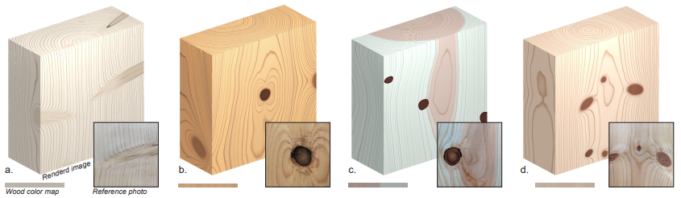
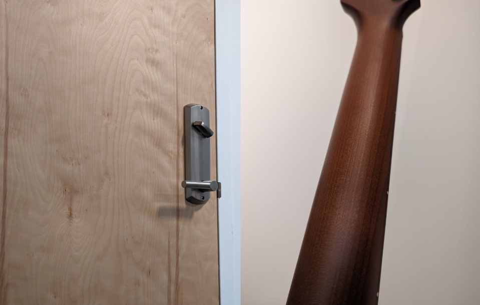
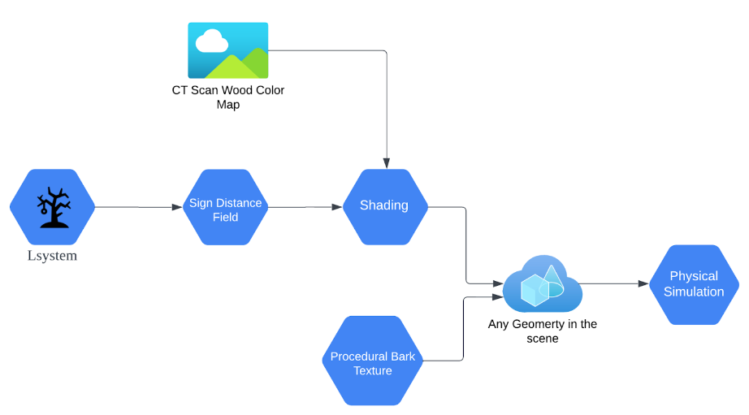
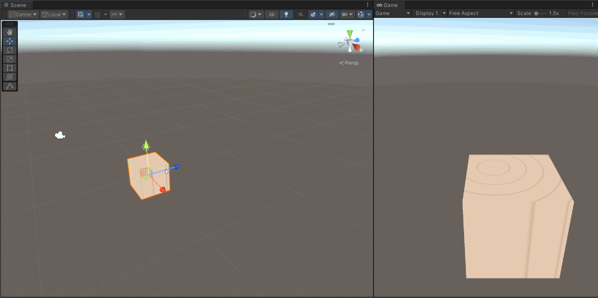
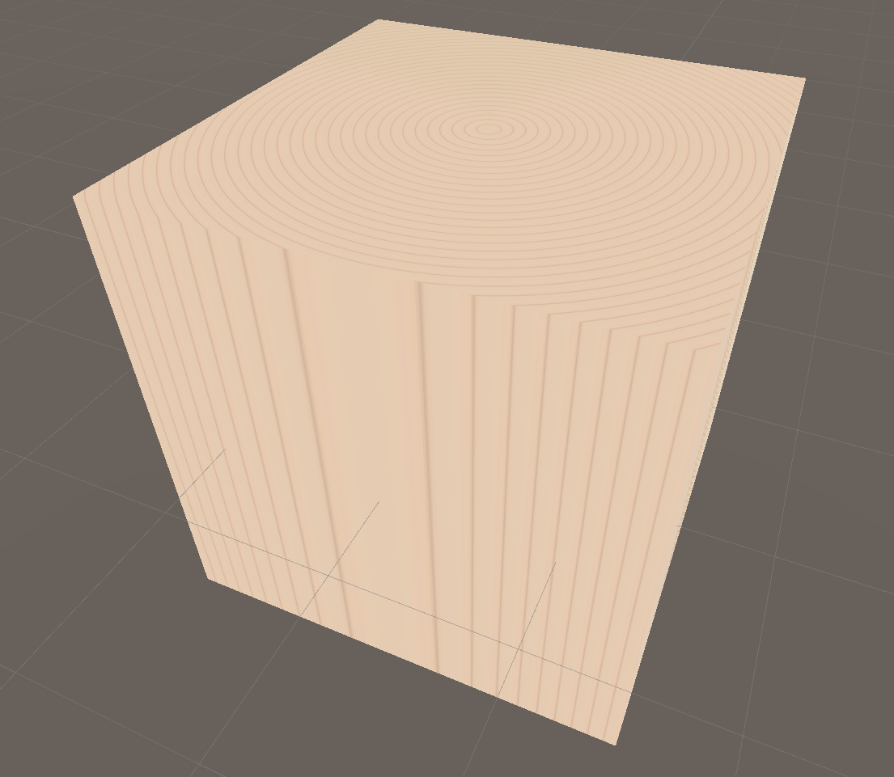
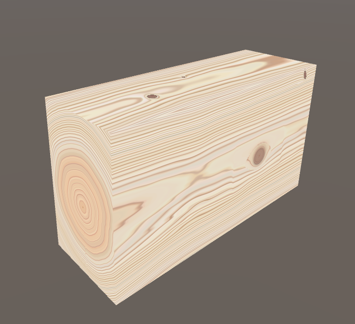
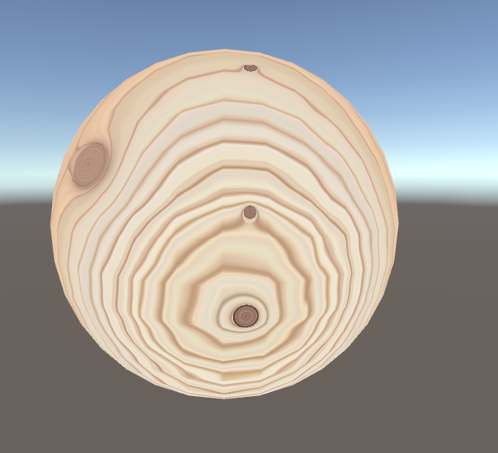
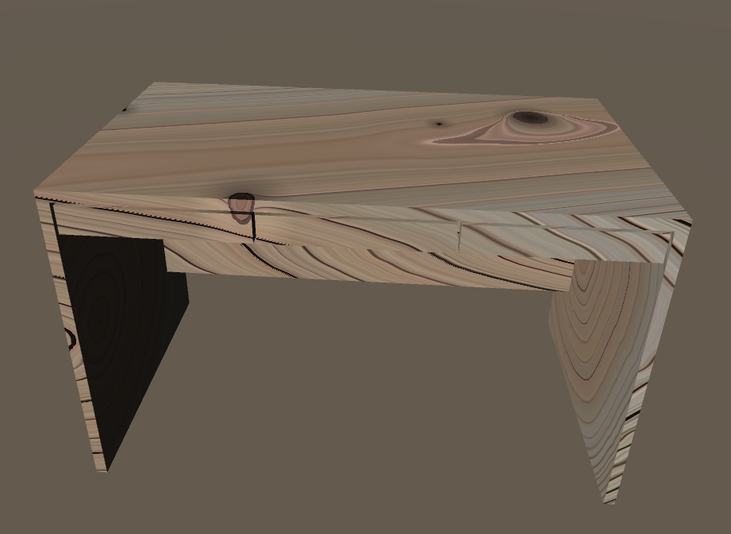
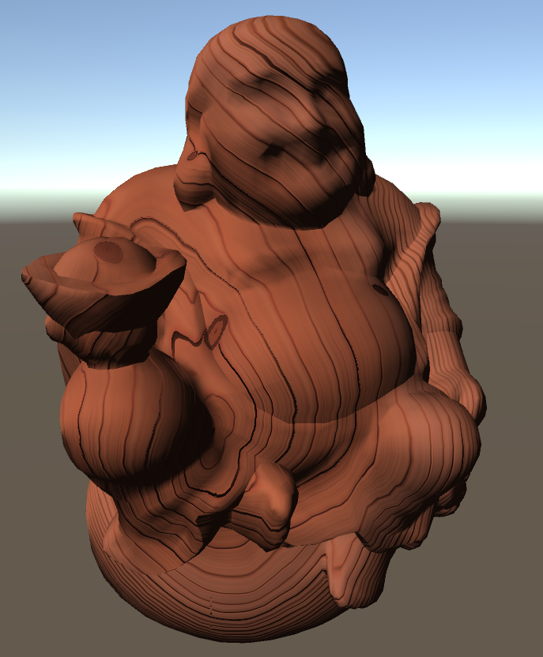
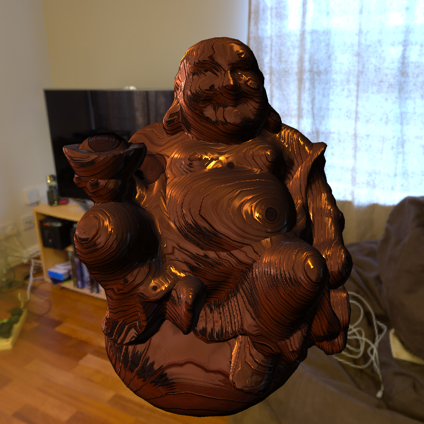

# CIS 5660 Final Project: Procedural Texturing of Solid Wood with Knots

## Design Doc

### Introduction 
 * Wood texture is a frequently utilized element in various applications and can be generated through procedural methods. However, many existing techniques tend to overlook the significance of knots, which can compromise the overall quality of the resulting texture. Consequently, we aim to create an efficient tool based on the paper [Procedural Texturing of Solid Wood with Knots](https://dl.acm.org/doi/10.1145/3528223.3530081) that will empower artists to procedurally generate lifelike wood textures, taking into account both living and deceased knots.

### Goal
 * Implement the algorithm presented in [Procedural Texturing of Solid Wood with Knots](https://dl.acm.org/doi/10.1145/3528223.3530081).
 * Integrate the algorithm into a Unity plugin for user-friendly utilization.
 * Generate wood textures in Unity using the tool to evaluate its performance.

### Reference & Inspiration
  * In this project, we will mainly refer to [Procedural Texturing of Solid Wood with Knots](https://dl.acm.org/doi/10.1145/3528223.3530081) and its [Git link](https://github.com/marialarsson/procedural_knots). 

   

   

### Specification:
This project will be implemented in Unity, benefiting from its convenient shader graph system and flexibility of adding custom functionalities. Our implementation can be separated into three parts:
 - Procedural generation of knot maps: this process will generate the internal skeleton representing where the knots and planks will appear in the wood volume in a way that resembles an L-system, then convert the structure to knot maps as input to solid wood texture generation.
 - Procedural generation of solid wood texture: this process generates wood texture from a 3D distance field converted from knot maps
 - Procedural generation of bark texture (stretch feature): in addition, we consider adding barks at the surface so that it can be used to simulate more general wood types

### Techniques:
 - The paper *Procedural Texturing of Solid Wood with Knots* as a reference of major techniques to be applied in this project
 - L-system for creating internal skeleton
 - 3D distance field for wood texture generation
 - Physically based surface material for rendering
 - Noise functions & normal mapping for bark texture generation (stretch feature)
 - Physical simulation (stretch feature): to demonstrate the wood texture by simulating a piece of wood breaking into smaller pieces

### Design:
The following diagram demonstrates the basic workflow of the algorithm.

   

### Timeline:
||Finish the L-system |
|:---:|:---:|
|Milestone 1| Sign distance field representation of branches|
|Milestone 2| Finish the L-system representation & Final shading|
|Milestone 3| Bark texture & create demo scene|

### Milestone #1

#### Demo

   

   

#### Progress
After reading the paper, we rearranged our milestone to firstly make the wood texture visible, which can benifit the debugging in our further develop.

Therefore, in the milestone #1:
   1. Explored shader lib in Unity
   2. Implement basic SDF function and wood texture
   3. Allow texture to vary with respect to position in virtual trunk
   4. Render virtual trunk in wireframe

### Milestone #2
#### Demo

   
   

#### Progress
In the milestone #2:
   1. Finish the key procdural wood texture algorithm that automatically generate diverse wood textures that are visually realistic and varied, with flexibility to adjust the positions, color, and size of knots.
   2. Finish the Branch representation, which support the knots adjustments.
   3. Allow texture to vary with respect to position in virtual trunk. We further developed this functions from milestone #1 to ensure texture can vary with respect to position in virtual trunk.

### Final Version
### Outcomes

|Lambert only |With environment map lighting|
|:-------:|:--------:|
|||

#### Live Demo

   

#### Progress
1. Finish normal mapping for wood texture with knots
2. Unity Skybox and Image based lighting setup
3. Final demo scene setup