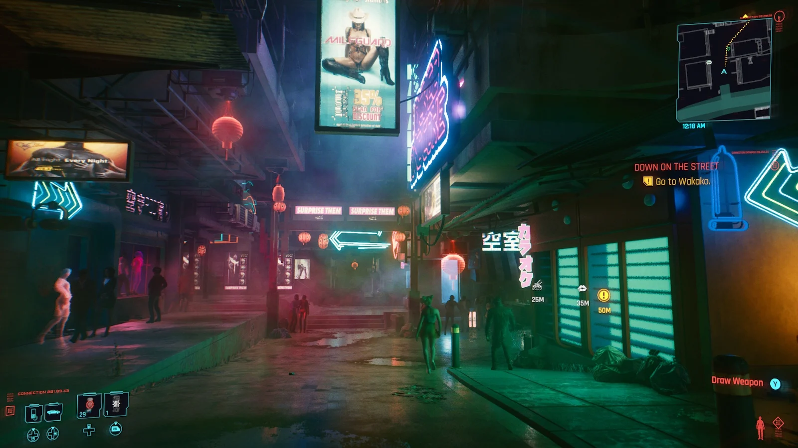

# Sci-Fi Corridor Generator
Authors: Tianyi Xiao and Linda Zhu

## Design Doc
### Introduction
- We are interested in creating a procedural generator of Sci-Fi game levels to assist artists with faster authoring of stylized scenes.
- We want to utilize various procedural graphics knowledge we learned from this class, e.g. shape grammars, and explore integrating popular 3D tools into one content authoring workflow.

### Goals
- Create a corridor system as a game level map that connects interior spaces given an input curve.
- The level assets such as panels, doors and decorations will be created in a procedural way using Houdini and then ported into Unity. 
- Assemble the final sci-fi level scene in Unity.
- Stretch goal: make the scene interactable with the player.

### Inspiration/reference:
- Inspired by many popular Sci-Fi movies and games, such as Cyberpunk 2077, Halo and Blade Runner, we want to implement a Sci-Fi style level.

 | [Cyberpunk 2077 Art Style](https://www.engadget.com/cyberpunk-2077-review-170013962.html)
---|---
 | [Halo 4 Environment Art](https://polycount.com/discussion/159954/the-environment-art-of-halo-4)
 | [Blade Runner Environment Art](https://polycount.com/discussion/193588/blade-runner-2049-memory-lab-environment-art-dump)
 | [Sci-Fi Circuit Board](https://youtu.be/X7T1NMm5fXw?si=8gHXMNfyAoAtDx7M)
 | [Sci-Fi Scene in Unreal Engine](https://cubebrush.co/blog/the-making-of-a-sci-fi-corridor-ue4-scene-breakdown)

### Specification:
- Generate the basic structures (corridor map, walls, floor and ceilling) of a game level in Houdini. Integrate these assets into Unity scene.
- Create objects (box, chair, etc.) procedurally for level decoration.
- Create textures for scenes.
- Paint/Populate our levels with textures and objects procedurally.
- Implement some render features to for better visual effect, such as SSAO.
- Make the level interactable.

### Techniques:

- Houdini VEX scripting and node networks.
- Procedural modelling using shape grammars and possibly L-systems.

- Will rely heavily on the references below:
  - We found a helpful [tutorial](https://www.sidefx.com/tutorials/sci-fi-level-builder/), which we believe could be good guidance for us.
  - This article talks about procedural modelling of a [sci-fi cylinder tunnel](https://polycount.com/discussion/101306/breakdown-of-scifi-cylinder-tunnel).
  - [Similar sci-fi scene assembled in UE4](https://cubebrush.co/blog/the-making-of-a-sci-fi-corridor-ue4-scene-breakdown)

### Design:
Orange cells are Houdini stages, green cells are Substance Designer/Painter stages and the blue cell is in Unity. We didn't include the stretch goals in the chart, except the procedural modelling of decoration objects, because we want to ensure the completion of the main project.

### Timeline:

- Week 1 (milestone 1):
  - Build a corridor map given an input curve that connects grids when the curve overlaps (Houdini - Tianyi). 
  - Figure out where the convex and concave corners are on the map to apply appropriate corner geometry (Houdini - Linda).
  - Link Houdini asset output to a Unity scene using the plugin Houdini Engine for Unity (Unity - Linda).

- Week 2:
  - Figure out where to place the walls, ceiling tiles and floor tiles (start off with some default prefabs) (Houdini + Unity - Linda).
  - Start digital assets generation using procedural modelling: doors and wall panels (Houdini - Tianyi).
  - Populate the scene with realistic lighting and other shading effects (Unity - Tianyi). 

- Week 3 (milestone 2):
  - Collect/ Create more textures (Online + Substance Designer - Tianyi).
  - Instead of using the same wall/floor/ceiling tiles everywhere, place procedurally generated digital assets with different sizes in the scene (Houdini - Linda).
  - Create more props and room objects, e.g. toolbox, machine, etc., for the scene (Houdini - Linda). 

- Week 4 (final):
  - Figure out where to procedurally place the props in the scene, e.g. around the corner or at the end of the corridor (Houdini - Linda). 
  - Decorate the scene by placing props and add other post-processing effects (Unity - Tianyi).
  - Do more testing and fix bugs (Both).
  - Create final renders to showcase and complete README (Both).

