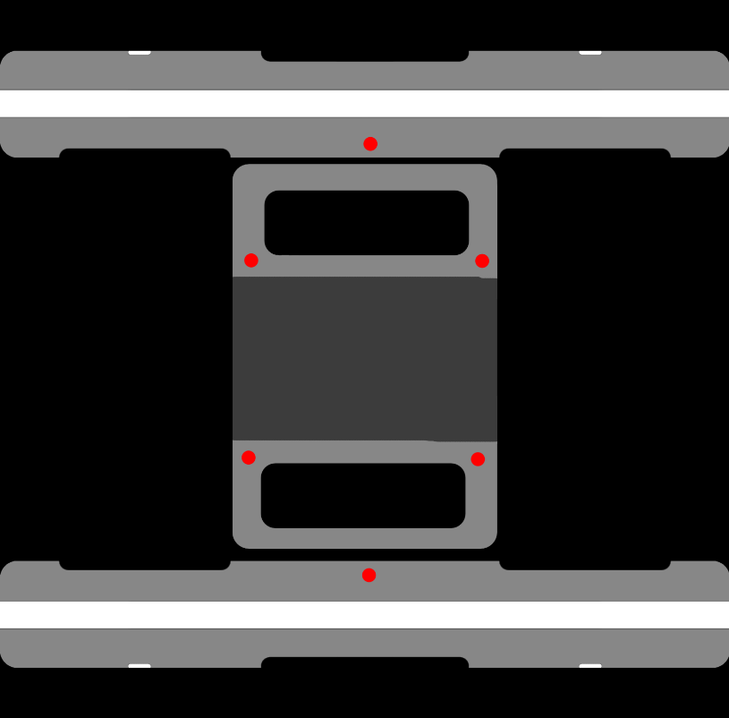
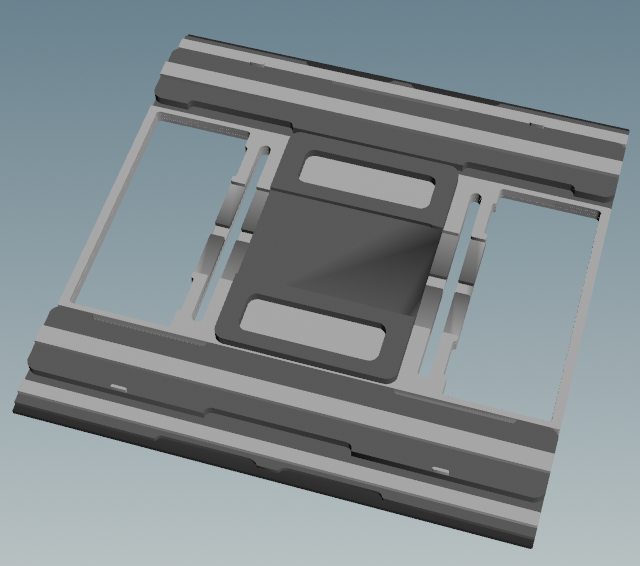
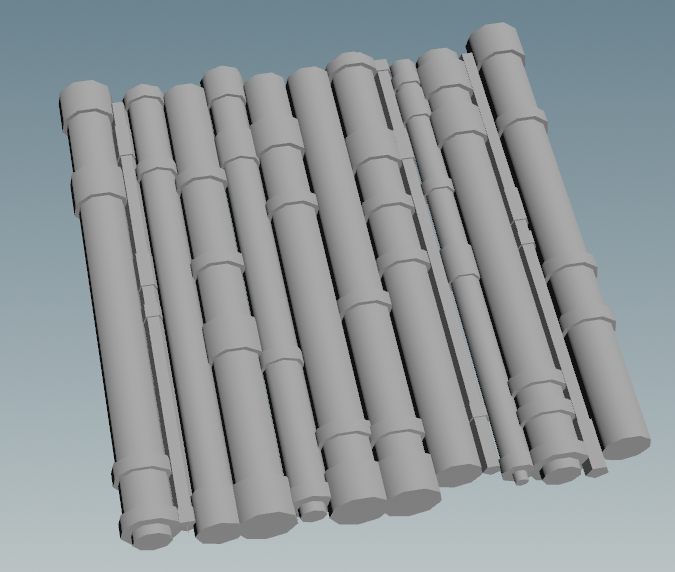

### Authors: Tianyi Xiao and Linda Zhu

## [Check out our interactive demo!](https://jackxty.github.io/Sci-Fi-Corridor-Generator/)
A simple treasure hunt built from our procedural asset pipeline. Have fun exploring!

Instructions:
- Mouse: Camera view orientation
- WASD keys: Movement directions, forward/left/backward/right
- SPACE key: Jump

## [Introduction Video](https://drive.google.com/file/d/11jnbuWwpp6BDBsoZ2qdruYy5CL9W41N9/view?usp=sharing)
Inspired by many popular Sci-Fi games, such as Cyberpunk 2077, Halo and Blade Runner, we are interested in creating a procedural generator of Sci-Fi game levels to assist artists with faster authoring of stylized scenes. We want to utilize various procedural graphics knowledge we learned and explore integrating popular 3D tools into one content authoring workflow.

Overview:

  
 Final 

## Post Mortem
  In general, we are very satsfied with our project, in terms of both the outcome and the collaboration process. We perfectly followed the planned timeline to work on this project. As a result, we have acheived all of the goals listed in each milestone of our deign doc. Besides finishing our own tasks, we also supported/helped each other on resolving problems and challenges encountered in our own parts, with smooth and effective communication. For future/stretch work, we want to simplify or remove some panel textures so that the environment looks less crowded. We could add additional visual features (interesting shaders, particle effect, or custom art design) to make our scene more polished in terms of a complete game level. We also wished to be more creative and original in adding our own spin in the art style. Nevertheless, considering a steep learning curve getting familiar with so many powerful features of new 3D software, mainly Houdini, within the time constraint, I believe we have done an excellent job. 

  The houdini assets workflow works out well with Unity, as we anticipated in the beginning after doing some research on the existing procedural references. Although there were compatibility issues of different versions and updates while using Houdini (including Houdini Engine), we are able to find workarounds with our effort. Now we have a deeper understanding in how Houdini work and what it can acheive.

  
 Milestone 3 

## Procedural Assets (Continued)
Now we have the backbone of a Houdini panel generator. We can mass-produce walls of different styles by just feeding in different input PSDs. However, for a balanced visual from the artistic perspective, we don't want our modular wall system packed with complicated structures, since we will also use the generator to create doors and ceilings. Moreover, we also want to support common image input formats, e.g. png, jpg/jpeg, and tga besides psd. To fulfill the needs, we repalce the layering subnet of the panel generator with a simpler logic, while keeping the high poly count and low poly count output subnets. The new layering version produces panels with simpler structures, i.e. fewer layers or less details.

Here's a comparison between the simplified version and the original version:
Door Generator (Simplified)  | Wall Generator (Original)
 ------  | :-----: |
 |

Here's the final collection of panel-like assets we used in the scene with texture on:

*A side note*: When painting the panels, we had to separate out geometry nodes and subnetworks of different structures, at least the base panel, the top panel, and the panel details, to allow Houdini to output the model in separate components. Furthermore, Houdini can only export models in Alembic, FBX and GLTF, while it's easier to work with Substance Painter using OBJs, so we manually converted major wall assets in Blender.

## Texture Generation
To create textures for procedurally generated models, we use Substance Painter to paint walls and doors with more complex geometry. From there we generate corresponding diffuse and metallic textures for the URP rendering pipeline.

For plain panels and ground textures, we opt for Substance Designer to modify textures from the [Yughues Material Unity asset package](https://assetstore.unity.com/packages/2d/textures-materials/metals/yughues-free-metal-materials-12949). We altered the source textures to make the color palette match our theme!

## Interactive Scene
Finally, we are here to assemble the scene with model prefabs, and add more playable features as in a complete Unity game developement pipeline!

### Player Physics
We integrated first-person player movement into the scene so that the user can move, jump, look around and trigger objects' behaviors. This is composed of two simple scripts attached to the `Main Camera` and a capsule game object, controlling the player camera/orientation and player position. 

Inside the corridor, the player can move through cells by sliding doors and collecting treasury boxes. Once you explored a new cell unit, the door you passed will be kept open to mark your path trace. We exposed some tunable parameters to allow users to achieve their own desirable physically-based movement.

### Dissolve Effect
To enrich the interactivity of the game level, Tianyi implemented a dissolve effect when player get closer to the box, which is controlled by a dissolve factor and a noise texture. In fragment shader, the noise texture will be sampled and compared with an increasing dissolve factor, if noise is smaller then it would be alpha-clipped, which looks like dissolved. What's more, I add a white edge at the area where nearly but haven't be clipped.

### Lighting
The final touch is to make the scene look realistic. We referenced these two tutorials [Realtime Interior Lighting](https://youtu.be/QhVPi1bfVEA?si=MB6LXnGlu5nYlJ1R) and [Baked Interior Lighting](https://youtu.be/_0AEcsyIQzc?si=cqaArDlz5h1sTen6) to utlitize the Unity Universal Render Pipeline (URP) features, along with a mix of post-processing effects.

This is the most difficult part as there're pros and cons of baked and realtime lighting. Baked lighting tends to look more natural than realtime lighting as all the lights blend nicely with the environment. However, with moving objects or in our case, the disappearing teasure box, baked lightmap will leave the box shadow as is after the box is "dissolved." Mixed lighting solves this issue but it leads to another mysterious problem that we couldn't resolve: the ceiling lights (point light) blink when the player/camera moves toward them. Since we are newbies to URP lighting, we decided to stick with mixed lighting and play around with the lightmap settings, as we can afford the tradeoff to ensure an overall visual quality.

  
 Milestone 2 

## Corridor Map System (Continued)
### Modular Wall
To have modular walls:
- Randomly pick up some walls to replace them with modular wall.
- Subdivide the wall with `Lab Lot Subdivision` and `divide` nodes, then adjust the modular shapes with `fuse`.
- Assign different unity prefab according to the size of wall pieces with `attribcreate`.

**In Houdini**

**In Unity**

### Asset Placement
We want to place assets in the large rooms of the level procedurally. And we want the assets to be placed near the walls, to avoid it block players' way. To implement this:
- Use `PolyExpand2D` node to figure out the large rooms in our level.
- Get area near walls with `PolyExtrude`. Then generate many points with `scatter` in these areas.
- Use `Group` to eliminate points outside the large rooms.
- Assign different unity prefab randomly to remaining points with `attribrandomize`.

**In Houdini**

**In Unity**

Also, we want to place some special asset at the end of each dead end corridor:
- First blast out all edge with concave corner points, which comes from milestone1, out of basic plane shape.
- Try to fuse each edge acoording to the unit size, to get mid point only from the real end, since their width is the unit size. Then eliminate other points at corner.
- Assign unity prefab to remaining points with `attribcreate`.

### Door
Similarly as first part of asset placement, we also want to place doors on the entrance place for large rooms in the level.

- Use the `PolyWire` to get the area near the edge of large rooms. The get cross points between these areas and central lines of the map, where we should place the door.
- Assign unity door prefab to remaining points with `attribcreate`.

**In Houdini**

**In Unity**

## Procedural Assets - Walls
We followed [this tutorial by Simon Verstratete](https://www.sidefx.com/tutorials/sci-fi-panel-generator/) to design our walls to have 3 layers of structures: a bottom panel, a top panel and panel details. The idea is to have an input image (greyscale or 3-5 tones). In houdini, extract layers based on different brightness or other color thresholds, assign geometries to those layers, and finally assemble them into one model. We want to the artist to have control of the design, i.e. input image, so besides the randomization parameters to tune in our geometry generator they still have the dominant authority.

Below is an example of input image in PSD file (We chose PSD since Photoshop has built-in layers and it happens that Houdini has a `Trace PSD File` to load PSD layers, but we can change it to any image format really).

  

|                    **Extracted Layers**              |
| Top Panel       || Bottom Panel           || Details ||
Layer 1  | Layer 2 | Layer 3 | Layer 4       | Layer 5 |
 ------  | :-----: | ------: |  -----------: | ------: |
 |  |  |  | 

Next, we can work on each individual layer. We start with the panels. Since the Sci-Fi style objects usually appear chunky/bulky/heavy without much delicate curvature, we simply `Thicken` the layers to turn a surface into a polygon, `Transform` the layer polygons mainly to ensure they stack on each other. 

  

Now we have the wall frame ready but they are mostly rectangles which look boring. For the panel details, we want to add more vairations in terms of geometry than just extrusion. Here we used the tiling brick from the LEGO-ifier project as the base model to be `Copy`ed`to Points` at the red dots. I added some randomization in the orientation of the blocks.

In addition to use the texture input, we created another 2 methods to decide where to place the ornaments. The first one uses `ray` tracing. We project rays from vector (0,-1,0), bascially looking down on the base panels, until the ray finds the top surface to collide with. We also use `Remesh to Grid` and `Measure Curvature` to avoid placing objects on any curved edges of the base panels. After we get the clean surface area, we `Scatter` a custom number of points to be the block positions. Changing the seed or the total count will generate more randomization. Lastly, considering that if we have symmetrical panels, we might want to `Mirror` the ornament placement too. After placing the ornaments, we can always adjust their orientations to create more variations.

Below shows how the 3 methods work differently:

Image Input  | Random Positions | Mirroring Positions |
 ------  | :-----: | ------: |
 | |  |

This example input image doesn't have line details (only dots) but I want to illustrate how you can use boolean shatter to carve lines out from the base geometry so I made separately a simple cube-based panel and a bezier curve. The logic is as follows:

- `Sweep` the curve with a polygon `Line` in a controlled direction. `PolyExtrue` the surface to have some width.
- In a `For-Each Connected Piece` loop connected to the base panel, use a `Boolean` shatter operation to output an edge gorup of A-B Seams from the extruded curve polygon.
- Use `Poly Bevel` to smooth the carved surfaces.

Boolean Shatter  | Panels with Details
 ------  | :-----: |
 |

To fill out the holes of the bottom panel, we add an array of pipes at the back. Pipes are composed of tubes and rings, the sizes of which can both be configured procedurally and randomly.

  

Before merging every layer, we tweaked more of the panels by bending them on the lower half.
Bend the Wall  | Final Output
 ------  | :-----: |
 |

Lastly, we created 3 modes of outputs of various polygon count for different needs: preview, highpoly and lowpoly. When we export to FBX and import the model in Unity as environment assets, we chose the lowpoly mode to minimize the package size. The user can choose which level of details when exporting in the menu, along with other parameters to configure the panels.

Menus
Top Panel  | Bottom Panel | Pipes | Advanced/Others |
 ------  | :-----: | ------: | ------: | 
 | |  |  |

### In Unity
Replacing the small wall type in Unity corridor scene with our textured procedural wall model!

  
 Milestone 1 

## Corridor Map System
### Ground Plane
The main highlight of our project is to generate a corridor scene solely based on an input curve, and the user can customize/ edit the curve nodes to update the map dynamically. So our first task was to tackle the grid-ification of a 3D curve and project that into a 2D plane, aka the corridor map (Figure 1). 

*Figure 1. Corridor Map Generation Workflow*

The process is approximately as following:
  - Use a `Transform` to scale down the input curve in Y so it's flatten onto the x-z plane.
  - Create multiple points on the curve using `Resample` to better grid-ify, i.e. snap the points to the cloest grid, the curve later using `Fuse`.
  - Next we can give the curve some width by `Copy`ing a base grid/square `ToPoints` on the curve.
  - After fusing the tiles into one single object, we `Dissolve` the inner edges and do some other group cleanup to get the final 2D plane. This step we use node functionalities from the SideFX Labs plug-in.

Input | 
---|---
**Gridification** |  
**Tiling** |  
**Grouping** | 

### Corners
Once we have the ground plane, it's convenient to detect the concave (green) and convex (red) corner points. The process is as following:
  - Based on the un-dissolved map and base grid's spacing, we can extrude the sides using `PolyExtrude`.
  - Use a `Labs Measure Curvature` node to measure convex and concave curvature values.
  - Extract the corner points using `Blast` nodes.

Tiling | 
---|---
**Extrusion & Curvature** | 
**Corner Points** | 

  
### Digital Assets for Unity
This part is the trickiest due to software compatibility. Figuring out the working versions of Houdini, Houdini Engine for Unity, and Unity is necessary for the corridor map exported as a Houdini Digital Asset (.hda file) to be editable inside Unity. To understand the workflow better here's a summary of the roles of each software:

#### Houdini
Where we procedurally generate the map and calculate points necessary for scene assets placement, e.g. points to place floor tiles, long and short wall panels, ceiling pipes, etc. Similar to the algorithm we learned in LEGO-ifier where we calculate the points to place differenty types of blocks.

#### Houdini Engine for Unity
In Houdini, networks of nodes can be easily wrapped up into HDAs then shared with other artists. With the Houdini Engine, these assets can be loaded into the Unity game editor with procedural controls available to artists.

The results can then be further manipulated in Unity. Anytime a parameter is changed on the asset, the Houdini Engine is called upon to "cook" the network of nodes and publish the results to Unity. This allows for deep integration of HDAs into a Unity game development pipeline. The game content is baked out when the game is published.

In short, only with the Untiy plug-in of Houdini Engine installed will we be able to edit the exposed parameters from the node network and dynamically adjust the output INSIDE Unity. In our project, the exposed parameter is the input curve. The user will be able to view, add, or edit any node on the curve to get a desirable corridor system.

#### Unity
The platform that hosts the complex game (or more precisely, 3D content) development pipeline. Since we leverage the heavy computation of points, aka asset positions, using Houdini, the output of the HDA is just a group of plain geometries, e.g. curves, points and quads. To assemble the actual scene with visually pleasing and stylistic 3D models/assets, we assign prefabs to the HDA output inside Unity. This allows artists to quickly populate places alike using the same assets, and freely change/update what prefabs they want to replace at certain places on the map. 

For milestone 1, we are only using native Unity geometries to test our corridor map HDA. Starting from milestone 2 we will create procedurally modeled assets in Houdini and import them into Unity as prefabs to replace the current walls and floor tiles.

Unity Demo |
---|
 | 
**Final Output** |
 |

### Walls
We are running ahead of the schedule so we continue on generating different types of walls.
  - Figure out where to place the walls, ceiling tiles and floor tiles (start off with some default prefabs).

  
 Design Doc 

### Goals
- Create a corridor system as a game level map that connects interior spaces given an input curve.
- The level assets such as panels, doors and decorations will be created in a procedural way using Houdini and then ported into Unity. 
- Assemble the final sci-fi level scene in Unity.
- Stretch goal: make the scene interactable with a frist-person player.

### Inspiration/reference:
 | [Cyberpunk 2077 Art Style](https://www.engadget.com/cyberpunk-2077-review-170013962.html)
---|---
 | [Halo 4 Environment Art](https://polycount.com/discussion/159954/the-environment-art-of-halo-4)
 | [Blade Runner Environment Art](https://polycount.com/discussion/193588/blade-runner-2049-memory-lab-environment-art-dump)
 | [Sci-Fi Circuit Board](https://youtu.be/X7T1NMm5fXw?si=8gHXMNfyAoAtDx7M)
 | [Sci-Fi Scene in Unreal Engine](https://cubebrush.co/blog/the-making-of-a-sci-fi-corridor-ue4-scene-breakdown)

### Specification:
- Generate the basic structures (corridor map, walls, floor and ceilling) of a game level in Houdini. Integrate these assets into Unity scene.
- Create objects (box, chair, etc.) procedurally for level decoration.
- Create textures for scenes.
- Paint/Populate our levels with textures and objects procedurally.
- Implement some render features in Unity for better visual effects, such as SSAO.
- Simple scripts to make the scene interactable.

### Techniques:
- Houdini VEX scripting and node networks.
- Procedural modelling using shape grammars and possibly L-systems.

- Will rely heavily on the references below:
  - We found a helpful [tutorial](https://www.sidefx.com/tutorials/sci-fi-level-builder/), which we believe could be good guidance for us.
  - This article talks about procedural modelling of a [sci-fi cylinder tunnel](https://polycount.com/discussion/101306/breakdown-of-scifi-cylinder-tunnel).
  - [Similar sci-fi scene assembled in UE4](https://cubebrush.co/blog/the-making-of-a-sci-fi-corridor-ue4-scene-breakdown)

(Edited on 11/20:)
More assets references to check out:
1. https://www.reddit.com/r/Houdini/comments/12eq4gk/scifi_panel_generator_wip/
2. https://www.artstation.com/artwork/r9zRXO 

### Design:
Orange cells are Houdini stages, green cells are Substance Designer/Painter stages and the blue cell is in Unity. We didn't include the stretch goals in the chart, except the procedural modelling of decoration objects, because we want to ensure the completion of the main project.

### Timeline:

- Week 1 (milestone 1) [due 11/15]:
  - [x] Build a corridor map given an input curve that connects grids when the curve overlaps (Houdini - Tianyi). 
  - [x] Figure out where the convex and concave corners are on the map to apply appropriate corner geometry (Houdini - Linda).
  - [x] Link Houdini asset output to a Unity scene using the plugin Houdini Engine for Unity (Unity - Linda).

- Week 2:
  - [x] Figure out where to place the walls, ceiling tiles and floor tiles (start off with some default prefabs) (Houdini + Unity - Linda).
  - [X] Start digital assets generation using procedural modelling: doors and wall panels (Houdini - Tianyi).
  - [X] Populate the scene with realistic lighting and other shading effects (Unity - Tianyi). 

- Week 3 (milestone 2) [due 11/27]:
  - [X] Collect/ Create more textures (Online + Substance Designer - Tianyi).
  - [X] Instead of using the same wall/floor/ceiling tiles everywhere, place procedurally generated digital assets with different sizes in the scene (Houdini - Linda).
  - [X] Create more props and room objects, e.g. toolbox, machine, etc., for the scene (Houdini - Linda). 

- Week 4 (final) [due 12/5]:
  - [x] Figure out where to procedurally place the props in the scene, e.g. around the corner or at the end of the corridor (Houdini - Linda). 
  - [X] Decorate the scene by placing props and add other post-processing effects (Unity - Tianyi).
  - [X] Do more testing and fix bugs (Both).
  - [X] Create final renders to showcase and complete README (Both).

### Resources & Credits:
1. [Metal textures](https://seamless-pixels.blogspot.com/2012/09/free-seamless-metal-textures_28.html)
2. [Yughues Free Metal Materials](https://assetstore.unity.com/packages/2d/textures-materials/metals/yughues-free-metal-materials-12949)
3. **SideFX tutorials by Simon Verstratete:**
    -  [Sci-fi Level Builder](https://www.sidefx.com/tutorials/sci-fi-level-builder/)
    -  [Sci-fi Panel Generator](https://www.sidefx.com/tutorials/sci-fi-panel-generator/)
4. [Sci-fi cylinder tunnel](https://polycount.com/discussion/101306/breakdown-of-scifi-cylinder-tunnel)
5. [First Person Player Movement in Unity](https://youtu.be/f473C43s8nE?si=LNNxxxcT9IQ6WuGo)
6. Basics of Interior Lighting in Unity URP:
    - [Baked Interior Lighting](https://youtu.be/_0AEcsyIQzc?si=cqaArDlz5h1sTen6)
    - [Realtime Interior Lighting](https://youtu.be/QhVPi1bfVEA?si=MB6LXnGlu5nYlJ1R)