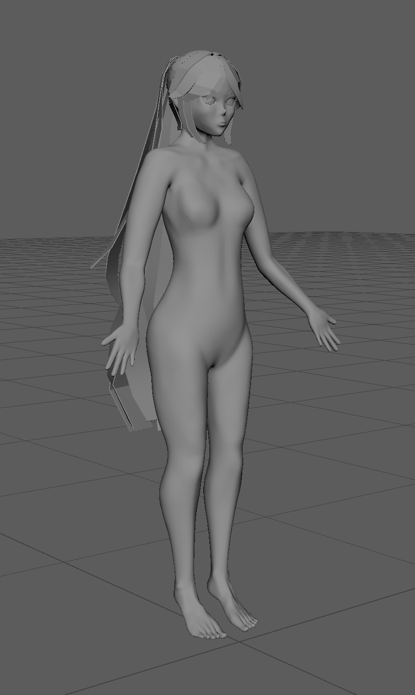
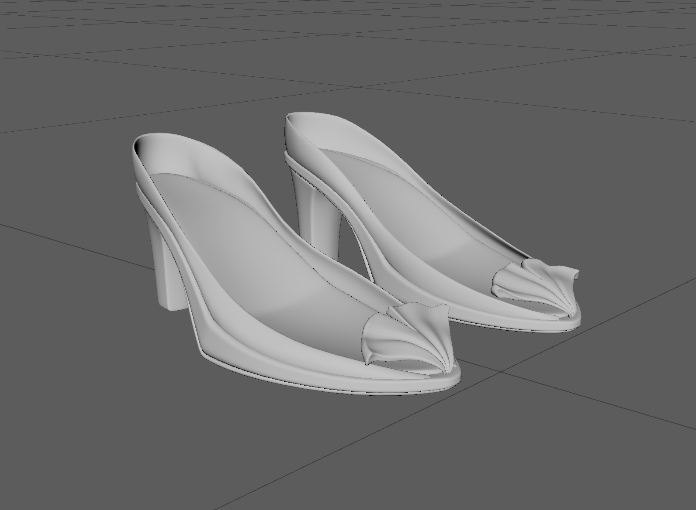
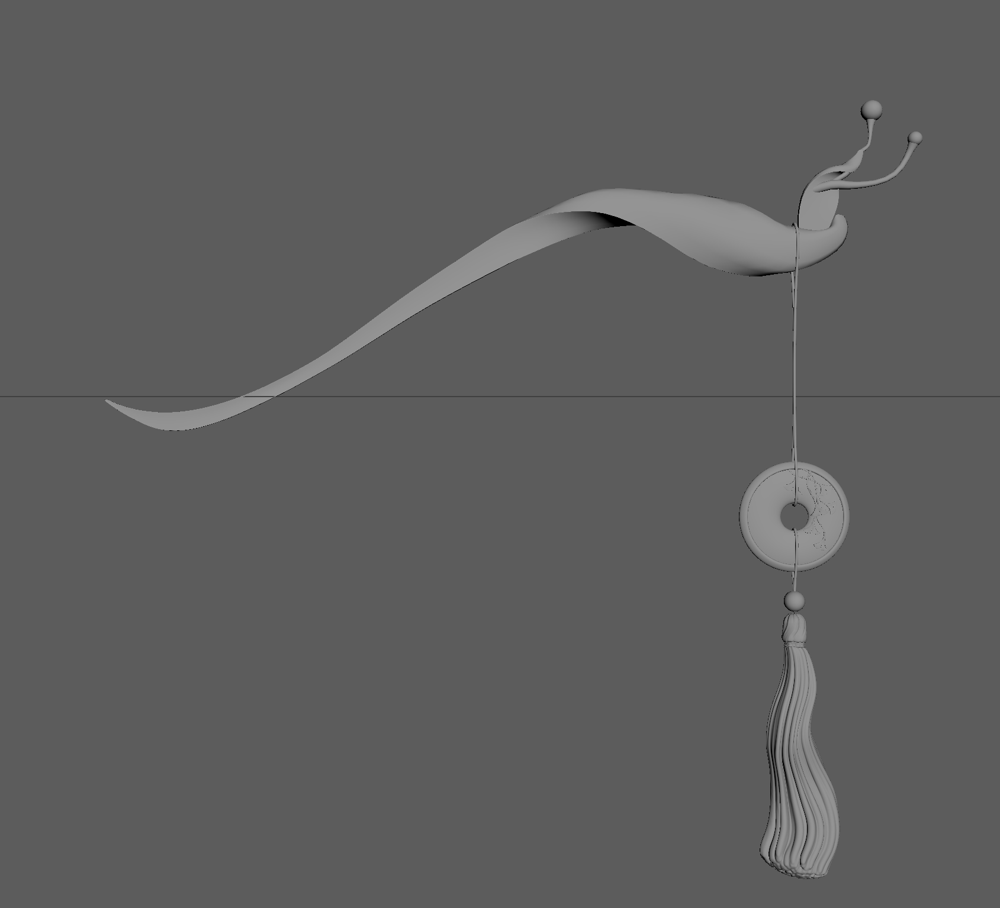
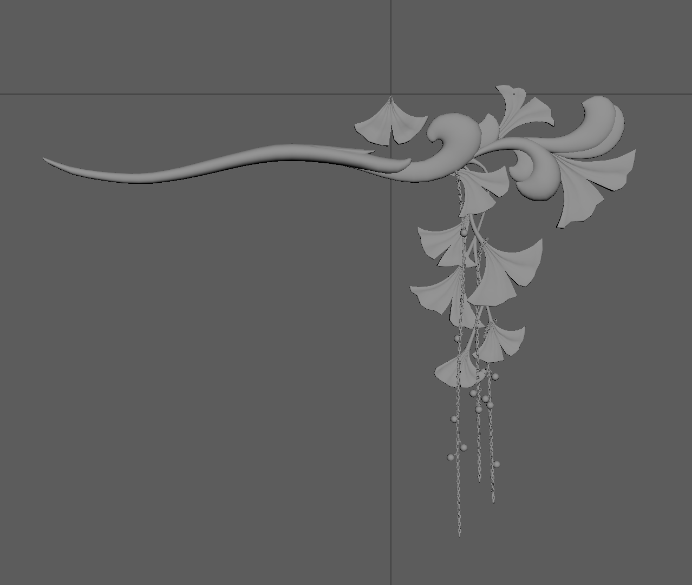
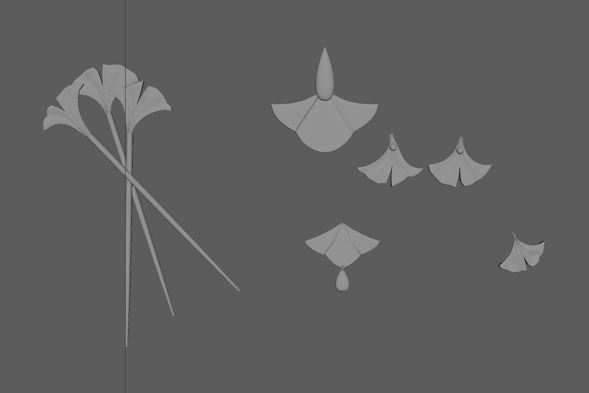
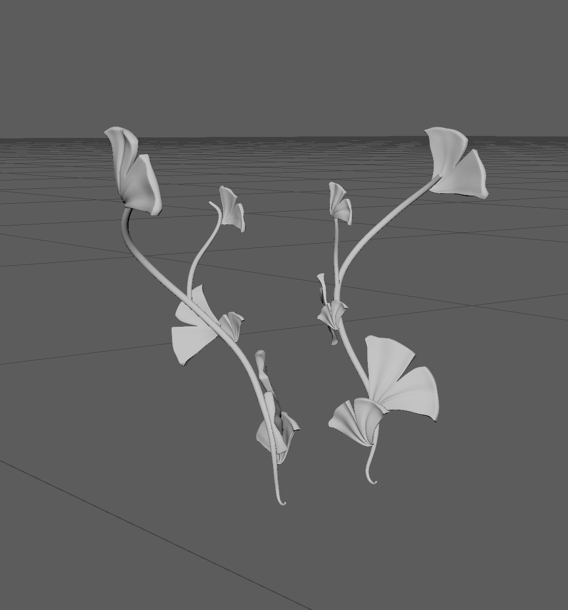
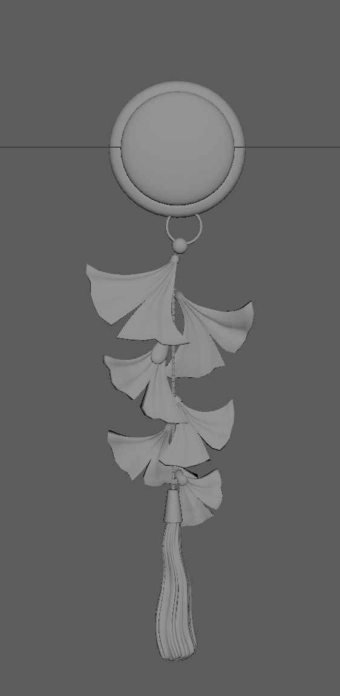
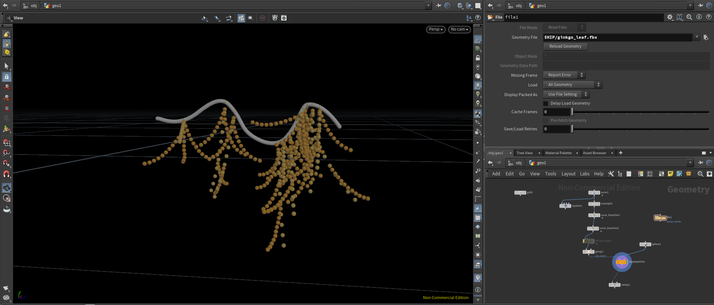

# CIS 5660 Final Project

#### Introduction
We were inspired to create this character by the various beautiful visuals of our favorite video game characters. 

#### Goal
Create a render of a ginkgo-themed character using a mixture of procedurally and manually modeled assets, procedurally-created textures, and procedural effects of ginkgo leaves falling off the dress. 

#### Inspiration/reference:
Design is based on a combination of traditional chinese clothing and fantastical elements. Inspired by Mihoyo’s Honkai Impact 3rd character designs.

(Original design by Jackie Li)

#### Specification:
- Manually modeled in Maya: hair decorations, clips, pins, shoes
- Manually modeled in ZBrush: figure, hair
- Manually modeled in Marvelous Designer: dress
- Procedurally modeled in Houdini: ginkgo leaves on bottom of dress/ sleeves
- Procedurally textured in Substance Designer/Painter: dress fabric textiles
- Cel-shaded in Unreal: hair, skin
- Unreal particle sim: effects of leaves falling off dress

#### Techniques:
For ginkgo branch: 
- Houdini VEX and Node systems
- L-systems

Texturing: 
- Cel-shading/ bucketing
- Vertex painting (lerp) for blending between materials on a mesh

Unreal Engine:
- Shaders (Post processing and surface)
- Particle Simulation

#### Design:

#### Timeline:
11/15: 
- Finish geometry and UV-unwrapping for all hand-modeled assets
  - Figure, hair
  - Dress
  - Props (hair deco, clips, pins, shoes)
- Start spline-based ginkgo branch generator in Houdini

11/27: 
- Complete a working ginkgo branch generator
- Create fabric textiles
- Unreal particle sim for falling ginkgo leaves
- Merge all elements together in UE5 (Preliminary)
- Create cel-shaded materials for skin and hair

12/5: 
- Refine and reimport various elements as needed
- Polish final image
  - Lighting
  - Background
  - Post process shaders

# Milestone 1 Updates

#### Accomplishments
- Modelled the head, body, and hair for our character.
- Finished modelling embellishments for character.
  - Hairpins, Shoes, Dress designs, etc.

 ##### Maya Modelling
 
|  |
|:--:|
|Body, hair, and head model.|

|  |
|:--:|
|Shoes model.|

|  |  |  |
|:--:|:--:|:--:|
|Pin Model 1|Pin Model 2|Pin Model 3|

|  |  |
|:--:|:--:|
|Ginkgo Clips|Ginkgo Ornament|

- Started on procedural generator for the branches. Plan to watch tutorials to create a branch generator, get only the endpoints of the branches, and adding leaves on there.
  - That will probably be the more difficult part for me to figure out, since I already have been having trouble trying to figure out how to parametrise my tool.
  - I am also simultaneously trying to figure out how to map a spline onto a mesh, since that will be where the procedural branch generator starts to grow.

##### Houdini Procedural Generator

