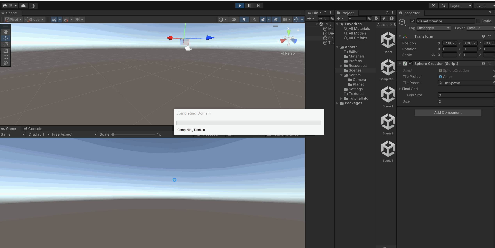

# Design Document
## Introduction
In this tile-laying game, players must strategically place procedurally generated tiles onto a hexagonal grid, ensuring that each tile connects appropriately to its neighbors; for instance, a forest tile must connect to another forest tile. 
We were initially inspired by the game Dorfromantik, which all of our team members deeply enjoy, particularly the satisfying experience of placing tiles to construct a town. Motivated by this, we've decided to develop a planetary version. Looking ahead, we plan to enrich the game by introducing a variety of new tiles, including animals, boats, and rivers. 

## Goal
We want to let the player create a procedural planet by putting tiles. At first, the planet is covered by ocean. Players will be provided with tiles that are associated with specific environments (such as forests, deserts, mountains, cities, etc.) Therefore, the player has the freedom to craft their own unique planet.
When the player places a tile, we fill it with Wave Function Collapse to ensure the most realistic appearance is achieved.  
  

## Inspiration/reference
Our inspiration is drawn from a game known as Dorfromantik, which is a tile-laying game offering an escape from reality. We are quite fond of its mechanics and aim to create a planetary version of it.  
[Dorfromantik:](https://store.steampowered.com/app/1455840/Dorfromantik/?l=schinese&curator_clanid=27093039)    
  

[Pan’orama:](https://store.steampowered.com/app/1730250/Panorama/)    

## Specification
Procedural part: 
1. Edge matching with wave function.
2. Procedural properties and elements for planets.

## Techniques:
1. Use Wave Function Collapse to fill the grid with the attention of adjacent grids. Reference: Stalberg, O. "[Wave Function Collapse in Bad North.](https://www.youtube.com/watch?v=0bcZb-SsnrA)" (2016).
2. The initial planet covered by the ocean is a perfect sphere rendered with an implicit surface.
3. Use noise function to generate clouds.

## Design
  

## Timeline
Milestone 1: Construct basic game level features and assets, develop the mapping of regular polygons on the surface of the planet.

Milestone 2: Enrich the integrity of the game level, implement Wave Function Collapse and disinform for regular polygons matching.

Milestone 3: Improve the game level, create procedural planets based on different properties like proportion of ocean, proportion of land, etc.

|             | MileStone 1                                                                     | MileStone 2                                                                      | MileStone 3 |
|  ----       | ----                                                                            | ----                                                                             | ----  |
| Alex Fu     | Finish the framework of Wave Function Collapse                                  | Adding attention to the adjacent tiles to the wave function. Make tiles seamless | Polish the procedural generation| 
| Jiefu Ling  | Design the Shader for the Planet and Get Modeling Prefabs of House, Trees, Ice. | Design atmosphere shader (cloud)                                                 | Create diverse planet surface shader    |
| Xiaoyue Ma  | Implement the mapping of regular polygons on the planet                         | Create procedural terrain on the planet                                          | Create procedural diverse planets   |

# Milestone 1
## Jiefu Ling
 - Water Shader

- Sand Shader

## Alex Fu

I wrote the basic Wave Function Collapse workflow in the class `WFCManager`, and designed the interfaces `Tile`, `Cell`, `Item`, and `Rule`. In Milestone 2 I will try to write a parser for `Rule`.

## Xiaoyue Ma

# Milestone 2
## Jiefu Ling  
 - Atmosphere + Cloud Shader
 - Fresnel Effect based atmosphere effect + simple noise based cloud effect

## Alex Fu
- I made a rule parser to make it easier for developers to modify Wave Function Collapse rules. The integers 0, 1, and 2 here represent the neighbors of a cell.
  
  

  

- Compute cell positions in a Hexagon tile. A cell has an equilateral triangle shape and its position is its barycentric location.
  

# Milestone 3

# Final Project!

This is it! The culmination of your procedural graphics experience this semester. For your final project, we'd like to give you the time and space to explore a topic of your choosing. You may choose any topic you please, so long as you vet the topic and scope with an instructor or TA. We've provided some suggestions below. The scope of your project should be roughly 1.5 homework assignments). To help structure your time, we're breaking down the project into 4 milestones:

## Project planning: Design Doc (due 11/8)
Before submitting your first milestone, _you must get your project idea and scope approved by Rachel, Adam or a TA._

### Design Doc
Start off by forking this repository. In your README, write a design doc to outline your project goals and implementation plan. It must include the following sections:

#### Introduction
- What motivates your project?

#### Goal
- What do you intend to achieve with this project?

#### Inspiration/reference:
- You must have some form of reference material for your final project. Your reference may be a research paper, a blog post, some artwork, a video, another class at Penn, etc.  
- Include in your design doc links to and images of your reference material.

#### Specification:
- Outline the main features of your project.

#### Techniques:
- What are the main technical/algorithmic tools you’ll be using? Give an overview, citing specific papers/articles.

#### Design:
- How will your program fit together? Make a simple free-body diagram illustrating the pieces.

#### Timeline:
- Create a week-by-week set of milestones for each person in your group. Make sure you explicitly outline what each group member's duties will be.

Submit your Design doc as usual via pull request against this repository.
## Milestone 1: Implementation part 1 (due 11/15)
Begin implementing your engine! Don't worry too much about polish or parameter tuning -- this week is about getting together the bulk of your generator implemented. By the end of the week, even if your visuals are crude, the majority of your generator's functionality should be done.

Put all your code in your forked repository.

Submission: Add a new section to your README titled: Milestone #1, which should include
- written description of progress on your project goals. If you haven't hit all your goals, what's giving you trouble?
- Examples of your generators output so far
We'll check your repository for updates. No need to create a new pull request.
## Milestone 3: Implementation part 2 (due 11/27)
We're over halfway there! This week should be about fixing bugs and extending the core of your generator. Make sure by the end of this week _your generator works and is feature complete._ Any core engine features that don't make it in this week should be cut! Don't worry if you haven't managed to exactly hit your goals. We're more interested in seeing proof of your development effort than knowing your planned everything perfectly. 

Put all your code in your forked repository.

Submission: Add a new section to your README titled: Milestone #3, which should include
- written description of progress on your project goals. If you haven't hit all your goals, what did you have to cut and why? 
- Detailed output from your generator, images, video, etc.
We'll check your repository for updates. No need to create a new pull request.

Come to class on the due date with a WORKING COPY of your project. We'll be spending time in class critiquing and reviewing your work so far.

## Final submission (due 12/5)
Time to polish! Spen this last week of your project using your generator to produce beautiful output. Add textures, tune parameters, play with colors, play with camera animation. Take the feedback from class critques and use it to take your project to the next level.

Submission:
- Push all your code / files to your repository
- Come to class ready to present your finished project
- Update your README with two sections 
  - final results with images and a live demo if possible
  - post mortem: how did your project go overall? Did you accomplish your goals? Did you have to pivot?

## Topic Suggestions

### Create a generator in Houdini

### A CLASSIC 4K DEMO
- In the spirit of the demo scene, create an animation that fits into a 4k executable that runs in real-time. Feel free to take inspiration from the many existing demos. Focus on efficiency and elegance in your implementation.
- Example: 
  - [cdak by Quite & orange](https://www.youtube.com/watch?v=RCh3Q08HMfs&list=PLA5E2FF8E143DA58C)

### A RE-IMPLEMENTATION
- Take an academic paper or other pre-existing project and implement it, or a portion of it.
- Examples:
  - [2D Wavefunction Collapse Pokémon Town](https://gurtd.github.io/566-final-project/)
  - [3D Wavefunction Collapse Dungeon Generator](https://github.com/whaoran0718/3dDungeonGeneration)
  - [Reaction Diffusion](https://github.com/charlesliwang/Reaction-Diffusion)
  - [WebGL Erosion](https://github.com/LanLou123/Webgl-Erosion)
  - [Particle Waterfall](https://github.com/chloele33/particle-waterfall)
  - [Voxelized Bread](https://github.com/ChiantiYZY/566-final)

### A FORGERY
Taking inspiration from a particular natural phenomenon or distinctive set of visuals, implement a detailed, procedural recreation of that aesthetic. This includes modeling, texturing and object placement within your scene. Does not need to be real-time. Focus on detail and visual accuracy in your implementation.
- Examples:
  - [The Shrines](https://github.com/byumjin/The-Shrines)
  - [Watercolor Shader](https://github.com/gracelgilbert/watercolor-stylization)
  - [Sunset Beach](https://github.com/HanmingZhang/homework-final)
  - [Sky Whales](https://github.com/WanruZhao/CIS566FinalProject)
  - [Snail](https://www.shadertoy.com/view/ld3Gz2)
  - [Journey](https://www.shadertoy.com/view/ldlcRf)
  - [Big Hero 6 Wormhole](https://2.bp.blogspot.com/-R-6AN2cWjwg/VTyIzIQSQfI/AAAAAAAABLA/GC0yzzz4wHw/s1600/big-hero-6-disneyscreencaps.com-10092.jpg)

### A GAME LEVEL
- Like generations of game makers before us, create a game which generates an navigable environment (eg. a roguelike dungeon, platforms) and some sort of goal or conflict (eg. enemy agents to avoid or items to collect). Aim to create an experience that will challenge players and vary noticeably in different playthroughs, whether that means procedural dungeon generation, careful resource management or an interesting AI model. Focus on designing a system that is capable of generating complex challenges and goals.
- Examples:
  - [Rhythm-based Mario Platformer](https://github.com/sgalban/platformer-gen-2D)
  - [Pokémon Ice Puzzle Generator](https://github.com/jwang5675/Ice-Puzzle-Generator)
  - [Abstract Exploratory Game](https://github.com/MauKMu/procedural-final-project)
  - [Tiny Wings](https://github.com/irovira/TinyWings)
  - Spore
  - Dwarf Fortress
  - Minecraft
  - Rogue

### AN ANIMATED ENVIRONMENT / MUSIC VISUALIZER
- Create an environment full of interactive procedural animation. The goal of this project is to create an environment that feels responsive and alive. Whether or not animations are musically-driven, sound should be an important component. Focus on user interactions, motion design and experimental interfaces.
- Examples:
  - [The Darkside](https://github.com/morganherrmann/thedarkside)
  - [Music Visualizer](https://yuruwang.github.io/MusicVisualizer/)
  - [Abstract Mesh Animation](https://github.com/mgriley/cis566_finalproj)
  - [Panoramical](https://www.youtube.com/watch?v=gBTTMNFXHTk)
  - [Bound](https://www.youtube.com/watch?v=aE37l6RvF-c)

### YOUR OWN PROPOSAL
- You are of course welcome to propose your own topic . Regardless of what you choose, you and your team must research your topic and relevant techniques and come up with a detailed plan of execution. You will meet with some subset of the procedural staff before starting implementation for approval.
