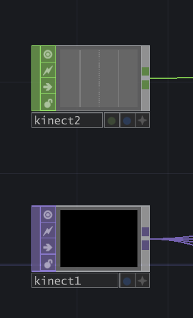

# :dvd:AlgebRave:dvd:

  
 Design Doc 

## Introduction
Ever since I played Dance Central by Harmonix Studios(now a part of Ubisoft) in middle school on my Xbox 360/kinect, I was mesmerized by the amalgamation of music and graphics that I got to experience. Fast forward to Fall 2023, when I am taking the Procedural Graphics class at Penn and with every new lecture, thinking back on how could I recreate a fraction of the experience that Dance Central provided me with. And here I am, trying to attempt it for the final project of that class!

## Goals
* **Technical Goal:** I want to create a procedural beat detection system for audio files, and use that to drive custom graphics & visual effects based on live input from Kinect.  
* **Intrinsic Goal:** Having fun! I want both the user of the tool as well as myself during its development to have a blast. I want to create something wherein one could play any song of their liking, and have fun interacting with the splash of graphics appearing on their screen - maybe bust a move or two :dancers:

## Inspiration/References
- Although I am not creating a dance-based pose-matching game, but the inspiration for the environment and the experience is certainly based on Dance Central. [This](https://www.youtube.com/watch?v=kuwB05ASh7E) is a trailer of their sequel, that gives an idea of what the game is about. [This](https://www.gdcvault.com/play/1014487/Break-It-Down-How-Harmonix) is a GDC talk where they _Break It Down_ their game design & development approach, which isn't relevant to this project but definitely is a good inspiration.
- [Wayne Wu](https://www.wuwayne.com/), a graduate from the same program did a very similar [project](https://github.com/wayne-wu/interactive-dance-projection/tree/main) last year. This will be a good reference point for me for the user interactivity & background parts.
- [John Alberse](https://www.johnalberse.com/), a fellow intern I met at Activision in Summer'23 had some experience with Projective Graphics. He shared [this](https://drive.google.com/file/d/1RECgq3cEmV_nBFP9xX_NIgyAxvJbxDen/view) piece of his work with me which I found really inspirational. Screenshot from his work:  
  

- Super helpful in getting started: [Introduction to TouchDesigner - Ben Voigt](https://www.youtube.com/watch?v=wmM1lCWtn6o)
- [Fluid Simulation using TouchDesigner](https://www.youtube.com/watch?v=2k6H5Qa_fCE)
- [Making Audio Reactive systems using TouchDesigner](https://www.youtube.com/watch?v=rGoCbVmGtPE)
- [Example of using TouchDesigner + Kinect](https://www.youtube.com/watch?v=tPYTXt1hSx4)
- [Audioreactive Kinect Dancer](https://www.youtube.com/watch?v=8ZgvxwmQGZw)   
  

- An example of particle system interaction in TouchDesigner:  
  

- An example of audio visualization in TouchDesigner:  
  

## Specifications
- A **Procedural Beat Detection** system created uisng **TouchDesigner** to identfiy basic parts of music like beats, drums, snares, bass, etc.
- Live input streaming from **Kinect** into TouchDesigner and using it to drive interactive visual elements.
- Incorporate **noise/toolbox functions** with **custom GLSL shaders** to write simple background effects driven off of music.

## Techniques
- **Procedural node-based tool**: Only recently I started gaining some experience with node-based tools like Houdini and Unity Shader Graphs. For this project, I will be using (and also, learning from scratch) **TouchDesigner** because of its ability to provide both great interactivity with Kinect as well as nodes to write custom GLSL shaders.
- **Kinect**: Since I already own a Kinect, even though the old one that shipped with the XBOX 360,, it is nonetheless a powerful device and therefore I'll be using the same for this project for its befitting abilities.
- **Toolbox Functions:** Writing custom shaders for visual effects almost never goes with using Toolbox and Noise functions. Although I haven't finalized each and every single visual aspect of the shaders, I am pretty sure I'll be routinely employing these tools for whatever I would want to achieve.
- **Optical Flow, Particle Simulation, Fluid Simulation, etc:** All such concepts fit really well with the vision for the project, and I will choose a subset of these while researching on the ease of their impolementation that aligns with the project's timeline.

## Design

## Timeline

### Week 1 ( 8 Nov'23 - 15 Nov'23)
* Implement the audio detection system in TouchDesigner that for a given audio file is able to generate signals for musical elements like beats, drums, snares, bass, etc.
* Target generating 4 such audio signals.
* Do a proof-of-concept by driving some basic graphics off a subset/all of these signals.

### Week 2 ( 15 Nov'23 - 22 Nov'23)
* Get started on the user input - hook up Kinect with TouchDesigner.
* Follow basic tutorial(s) to get some easy wins like particle system interactions.
* Implement at least 2 user-interactive features using tools like Optical Flow and Fluid Simulation.
* Hook up audio signals into these features.

### Week 3 ( 22 Nov'23 - 29 Nov'23)
* Work on developing simple yet visually pleasing audio-driven backgrounds.
* Implement 4 different backgrounds driven off of the generated audio signals.
* Combine everything together - audio signals, user input-based Kinect signals, and shader backgrounds.

### Week 4 ( 29 Nov'23 - 6 Dec'23)
* Tackle any delays from the previous milestones.
* Polish, polish, polish!
* Work on documentation.
* Ask fellow students to experiment with the tool and capture some recordings.
* Make a trailer for AlgebRave!

  

  
 Milestone 1 

## Milestone 1 - Week 1 ( 8 Nov'23 - 15 Nov'23)

### Components
1. [TouchDesigner Basics](#touchdesigner-basics)
2. [Kick Detection](#kick-detection)
3. [Snare Detection](#snare-detection)
4. [Spotify Connectivity](#spotify-connectivity)
5. [Summary](#summary---milestone-1)

For my Milestone 1, I was able to achieve the following:  
1. Getting familiar with TouchDesigner and the most common tools/functionalities that I'd be needing.
2. Making 3 audio signals that would help me drive graphics:  
   - Bass/kick detection
   - Snare detetion
   - Audio visualization
3. Getting input from Spotify instead of a local audio file to make the system more widely usable.

Here is a demo video of the audio detection system in action (with the default TouchDesigner audio file)(Sound ON:sound:):  
 

https://github.com/Saksham03/algeb-rave/assets/20259371/2beda103-c26e-4a3c-933e-2a7a72884350

### TouchDesigner Basics
- The [Introduction To TouchDesginer by Ben Voigt](https://www.youtube.com/watch?v=wmM1lCWtn6o) is a superb resource to get started on the software. I had already gone through the whole thing during the Summer when I was playing around with TouchDesigner, but now was a good time to brush up on the snippets from that video that I thought would come in handy.
- As I was just getting started, I had the bigger picture in mind of a vast, unmanageable node network - one that is pretty common when using node-based softwares. Hence from the get go, I wanted to make separate isolated and independently manageable components for as many things as I could. [This video](https://www.youtube.com/watch?v=oTFZXL2xbvw) by [bileam tschepe (elekktronaut)](https://www.youtube.com/@elekktronaut) was extremely helpful in guiding me towards building **Components** in TouchDesigner, and **exposing the parameters** on these custom nodes that I would possibly want to tweak later.

### Kick Detection
- The first thing I build was the bass/kick detection, and I followed [this](https://www.youtube.com/watch?v=gUELH_B2wsE) video by [elekktronaut](https://www.youtube.com/@elekktronaut). I also looked up a couple of other resources and tweaked the parameters to my liking, but that video established the solid groundwork of my understanding of how kick detection was supposed to work. This is what my kick detection workflow looks like:
  
The highlighted path in the above image is to show that the kick detection was built as a separate component so that it is easy to manage, and lives one level inside the root level of the project.
-  As stated above, I built the kick detetor as a separate component. On the custom node, I exposed several parameters that I thought were enough to provide me with the control to tweak the output kick detection signal to my liking. These are the parameters that are available for this node at the project's root level:  

### Snare Detection
- I moved on to snare detection, and pretty much followed the same resource as the kick deteciton one. I had to combine some learnings from [this](https://www.youtube.com/watch?v=rGoCbVmGtPE&t=2s) video as well, and snares became an easy win after kick detection. This is what my snare detection workflow looks like:
  
Again, the highlighted path in the above image is to show that the snare detection was built as a separate component.
-  On the custom node, there are several parameters that are available for this node at the project's root level to tweak the result to my liking:  

### Audio Visualization
- As stated initially in my design doc, I was aiming to get 4 audio signals out of an input audio. But I couldn't find enough resources apart from the basic kick and snare detection. I looked at some audio-specific tutorials that were independent of TouchDesigner, but they were either too detailed an went over my head or were not possible to be implemented in TouchDesigner. Besides, I figured that these 2 signals were enough for me to drive some cool graphics/visuals.
- What I really wanted to do was to isolate the vocals from a track and display them as pulsating bars. Although I failed to figure out a way to isloate the vocals, I did manage to find [this great resource](https://www.youtube.com/watch?v=VwEoniNx5e8&list=PLFrhecWXVn59fuqALP_Hb6qRKEXy4LVQp&index=12) that helped me build an audio visualizer.
- I also built my audio visualizer in a separate component of its own. The node-based workflow for my audio visualizer looks something like this:

### Spotify connectivity
- Since I wasn't able to get more audio-related signals from the input as I had planned, I thought of other ways of making my project more fun - and one of them was certainly being able to plug and play any song, and not just from the limited audio files residing on my local machine.
- I was able to achieve this using a 3rd party software called VB-Cable. And [this video](https://www.youtube.com/watch?v=HR6Ot3w6qTo), again by the amazing [elekktronaut](https://www.youtube.com/@elekktronaut) was very helpful in guiding me how to do it.

### Summary - Milestone 1
- I achieved most of my milestones, and seem to be in a pretty good shape to proceed with my next milestone.
- I wasn't able to achieve just one milestone - generating 4 audio signals. I was able to get essentially only 2 (3 if you count the visualizer, although it is not a 'signal' that I would use to drive visuals), due to the lack of both resources as well as my experience with TouchDesigner/Audio manipulation. This is not a problem though, as those 2 signals should be enough to get fun audo-driven graphics.
- Because I couldn't fully complete one of the milestone tasks, I took on the additional task of hooking up AlgebRave with Spotify, and it works. I also added the audio visualizer in this milestone itself, which would give me a headstart for the next one.
- The system as it stands is not ideal - the parameters need some tweaking for different audio inputs, and work well mostly in the middle parts of the song. This is something out of my hands, because TouchDesigner works with the audio files on-the-fly instead of a preprocess, and since we work with normalized values, the beginning/ending of songs usually have a different music pattern than the rest of the track that throws off the system a bit. But, I am taking this as good learning for myself and proceeding with the project with what I have.

  

  
 Milestone 2 

## Milestone 2 - Week 2 ( 15 Nov'23 - 22 Nov'23)

### Components
1. [Hooking up Kinect with TouchDesigner](#hooking-up-kinect-with-touchdesigner)
2. [Network Summary](#network-summary)
3. [Trippy Edges effect](#ramping-up---trippy-edges-effect)
4. [Hand Trails & Swiggly Lines](#referring-dance-central-again---trails--swiggles)
5. [Fire Simulation Effect](#human-torch)
6. [Audio-Reactive Visuals](#audio-reactive-input)
7. [Summary](#summary---milestone-2)

Milestone 2 was SO MUCH FUN! And not only I was able to hit all my milestones, I was able to do more than that! I had planned to get 2 interactive graphical features implemented, but I was able to get 4, in addition to the other milestones of hooking up kinect and doing a preliminary audio-driven test. These are the 4 effects I was able to make:  

  

### Hooking up Kinect with TouchDesigner
TouchDesigner has a kinect node which makes it super easy to interact with the device, and also exposes a lot of the features as a black-box which kinect is capable of, e.g. depth buffer, infrared sensor, detecting body parts like hands/neck/legs/etc.  
  
Next, for connecting Kinect to my system I had to buy an [adapter](https://www.amazon.com/Kinect-Adapter-Compatible-Mircosoft-Charging/dp/B093CYW12Z/ref=sr_1_4?keywords=kinect+pc+adapter&qid=1700714724&sr=8-4) because the Kinect uses a different USB port type. Next, to allow Kinect to talk to my system, I needed the requisite drivers, which are provided by Microsoft's app [Kinect Studio](https://learn.microsoft.com/en-us/windows/apps/design/devices/kinect-for-windows). Once connected, I was able to see the kinect capture being streamed into my TouchDesigner node.

### Network Summary
As I did with the audio detection milestone, I followed the same principal of making separate nodes for each effect and exposing the relevant parameters on these custom nodes. Hence, the overall network looks super clean and easy to plug-and-play:
  
On the left are the 2 different types of Kinect input nodes that give me access to various buffers/data being captured by kinect. The other 4 nodes are my custom effects, which I will explain one by one.

### Ramping Up - Trippy Edges effect
To get started, I first watched [this](https://www.youtube.com/watch?v=QGuquFiInqY&t=80s) video again by the amazing [elekktronaut](https://www.youtube.com/@elekktronaut). This helped me give an overview of the different kinds of nodes I could use with the kinect input, and create a cool trippy effect with the color scheme I like. In summary, the trippy edges node network looks like this from the outside and exposes just one parater that allows the user to tweak how long they want the outlines to persist for:  
  
On going inside the network, it looks something like this:  
  
This was a good node to get started with, because I had a decent demo I could follow and then tweak it to my liking. The final result looked something like this:  

### Referring Dance Central Again - Trails & Swiggles
One of the things I found really cool in Dance Central was the cool glowing trails they incorporated into the gameplay that followed the players hands:  
<table>
  <tr>
    <td></td>
    <td></td>
    <td></td>
  </tr>
  <tr>
    <td colspan="3" align="center"><i>Hand Trails in Dance Central</i></td>
  </tr>
</table>  

But in addition to the trail effect, I needed some effect to composite it with that gave the player some indication as to where their silhoutte in the scene was. And [this](https://www.youtube.com/watch?v=0z-PxjPOOCY) gave me the perfect effect to incporporate. So, I created a separate node for this effect:  
  
The node exposes 2 controls - how large the trail radius needs to be, and how 'laggy' it can be. If you look inside the node, a lot is going on:  
  
Essentially, the top half of the workflow handles the trail generation while the bottom half makes the squiggly lines. It was particularly difficult to make the trails buttery smooth, because the kinect input was very abrupt and discrete. But poking around with different nodes, watching a bunch of tutorials, and my all my gathered learnings till date helped me achieve the look I wanted. I was really happy with the final result, which looked something like this:  
  
When put next to the trippy edges effect, it looks something like this:  

### Human Torch!
For my next effect, I wanted to achieve the fluid simulation effect similar to my friend John's work referenced in the design doc. But poking around, I found [this](https://www.youtube.com/watch?v=A-xOp1LTchY) cool video that went over how one could do fire simulation using a new node type recently introduced in TouchDesigner that uses Nvidia's Flow simulation. This was perfect for me, as I could plug and play with the feature instead of writing a fluid simulation from scratch. And hence, this node turned out to be an easy win. Following the tutorial and plugging it into my tutorial was easily doable with a small network like this:  

And after spending a lot of time tweaking dozens of simulation parameters, I was able to get the following effect:  

### Audio-Reactive Input
As mentioned in my Week 2 Milestone tasks, I wanted to a proof-of-concept by driving some visuals using the audio detection I done for my 1st milestone. I chose to just apply a simple offset to the edges using snares from the audio. My custom node for the same looks like this:
  
It exposes only one paramter - how much the edges need to be offset by. The network itself looks like this:  
  
And the final result turned out to be really fun! Here is a short clip from a test run(Sound ON:sound:):

https://github.com/Saksham03/algeb-rave/assets/20259371/2e377dd3-8fd5-4453-a2d9-00dcabd1f636

### Summary - Milestone 2
As I said earlier, Milestone 2 was not only fun but I was also able to do more than I had expected. I will have to be really careful while driving the kinect input with audio though, because the background will also be audio-driven and I don't want the visuals to get too messy or overwhelming for the user. I am really excited to work on the background visuals, and finally plug everything together to see how AlgebRave turns out!

  

  
 Milestone 3 

## Milestone 3: Implementation part 2 (due 11/27)
We're over halfway there! This week should be about fixing bugs and extending the core of your generator. Make sure by the end of this week _your generator works and is feature complete._ Any core engine features that don't make it in this week should be cut! Don't worry if you haven't managed to exactly hit your goals. We're more interested in seeing proof of your development effort than knowing your planned everything perfectly. 

Put all your code in your forked repository.

Submission: Add a new section to your README titled: Milestone #3, which should include
- written description of progress on your project goals. If you haven't hit all your goals, what did you have to cut and why? 
- Detailed output from your generator, images, video, etc.
We'll check your repository for updates. No need to create a new pull request.

Come to class on the due date with a WORKING COPY of your project. We'll be spending time in class critiquing and reviewing your work so far.

  

  
 Final Submission 

## Final submission (due 12/5)
Time to polish! Spen this last week of your project using your generator to produce beautiful output. Add textures, tune parameters, play with colors, play with camera animation. Take the feedback from class critques and use it to take your project to the next level.

Submission:
- Push all your code / files to your repository
- Come to class ready to present your finished project
- Update your README with two sections 
  - final results with images and a live demo if possible
  - post mortem: how did your project go overall? Did you accomplish your goals? Did you have to pivot?

 
