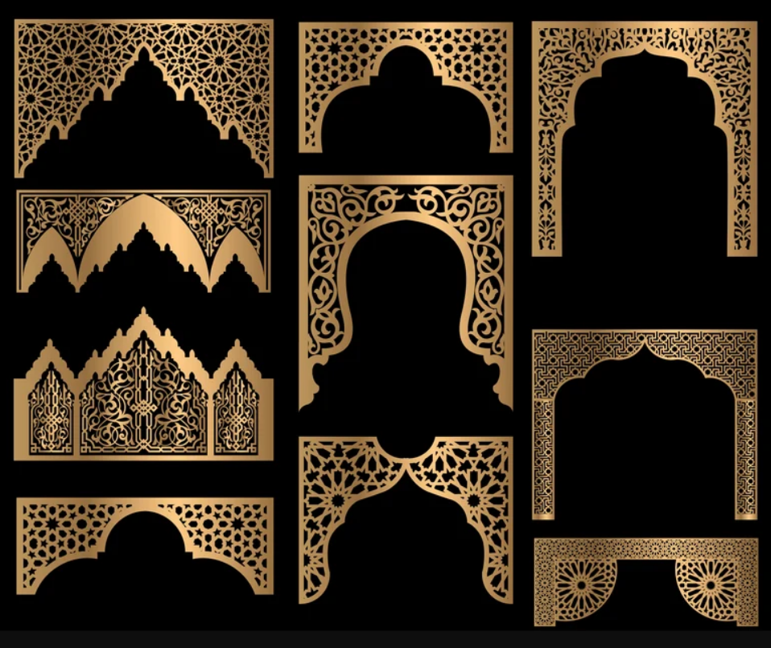
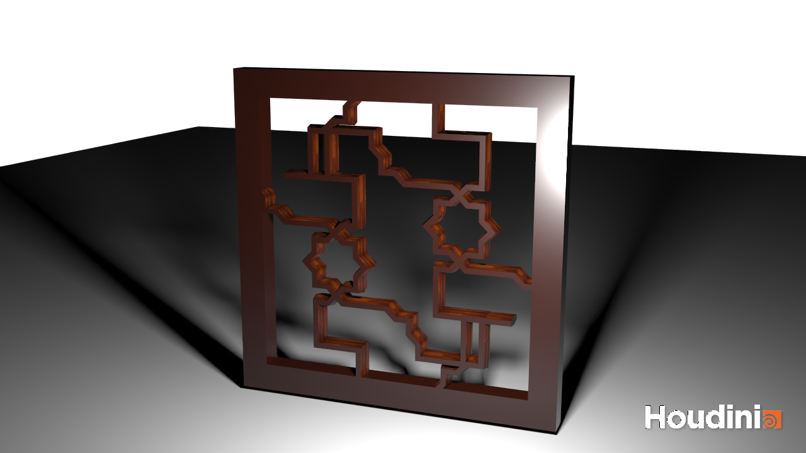

# Islamic Geometric Wood Carving Tool

Check out the [demo](https://youtu.be/sME_ZO3Bp3c).

### Design Doc

#### Introduction
Islam rose in 7th century Arabia as a stark refutation to the idol-worshipping pagans who
 dominated the region economically, politically, and in their sheer number. Having belief in one God
 for whom no manmade idol could represent, the Muslims, upon successful disemination of their
 religion and beliefs across the peninsula, haulted all art depicting living beings. In its stead,
 a new form of art was championed &ndash; one that still captured a beautiful aspect of God's
 creation that may not have been breathing, but was very much alive: geometry.

#### Goal
Through this project, I aim to create a Houdini node that can produced the complex
geometric patterns that are essential to so many pieces of Islamic art. Harnessing the power of a
procedural system, I hope to add a dynamic element onto the baseline patterns by animating the
patterns, either within a single pattern's context, or perhaps even animating between different
patterns.

To maintain the craftsmanship that is so essential to the appreciation of these
decorative wooden arches, carpets, and architectural structures, the tool will be applied to wooden
slabs.

Although this project is not intended to culminate in a single polished scene to show for, I plan to
situate multiple wooden arches and slabs with disparate shapes together in a simple scene &ndash;
perhaps a small room with a Islamic carpet.

#### Inspiration/reference:

Reference #1:

[Source](https://www.etsy.com/listing/1467150352/set-of-decorative-arches-islamic-arabic?gpla=1&gao=1&&utm_source=google&utm_medium=cpc&utm_campaign=shopping_us_d-craft_supplies_and_tools-patterns_and_how_to-patterns_and_blueprints&utm_custom1=_k_CjwKCAjwkY2qBhBDEiwAoQXK5e3zWAU40x-ESz_xxUsEbw_pSet9z7k0Me79Zgcc4MTAHoWqSTIgJRoCcxAQAvD_BwE_k_&utm_content=go_2063558056_76452866095_367965825024_pla-322726483858_c__1467150352_12768591&utm_custom2=2063558056&gclid=CjwKCAjwkY2qBhBDEiwAoQXK5e3zWAU40x-ESz_xxUsEbw_pSet9z7k0Me79Zgcc4MTAHoWqSTIgJRoCcxAQAvD_BwE)

Reference #2:

[Source](https://www.etsy.com/listing/1365553332/set-vector-arches-dxf-eps-svg-ai-pdf-png?click_key=567e1af9aaf9f8ea4ad89f283786370ebc24bdfd%3A1365553332&click_sum=7c5186a7&external=1&rec_type=ss&ref=pla_similar_listing_top-1&sts=1)

Reference #3:

[Source](https://www.alamy.com/seamless-geometric-ornament-based-on-traditional-arabic-art-muslim-mosaicblack-lines-and-white-backgroundgreat-design-for-fabrictextilecoverwrap-image339544071.html)

#### Specification:

The project will be a Houdini node that will take geometry as its input, and cut from it the
specified geometric pattern. The geometry will be specified by a node parameter that the user will
have to set themselves. I will be developing the node with the assumption that simple wooden
slab-like geometry is being input into the node, and so not all geometry will result in the desired output.

The user will have control over:
  1. the pattern type
  2. the scale of the pattern within the object
  3. whether the object is animating 
  4. animation speed
  5. pattern fade
      - the user can select two patterns, and the node will cyclicly interpolate back and forth
        between the two different patterns.

#### Techniques:

- L-Systems
  - [The Algorithmic Beauty of Plants - Aristid
    Lindemayer](http://algorithmicbotany.org/papers/abop/abop.pdf)
  - [L-System Tutorial](https://www.youtube.com/watch?v=CgxTCpUqp5Q)
  - [L-System User Notes - Paul Bourke](https://paulbourke.net/fractals/lsys/)
  - [Houdini L-System
    Docs](https://www.sidefx.com/docs/houdini/nodes/sop/lsystem.html#use-modeled-geometry-in-an-l-system)
  - [Generating Trees and Other Interesting Shapes With L-Systems](https://gpfault.net/posts/generating-trees.txt.html)
- Greedy algorithm (similar to one used in lego project):
    to fill up the volume of the input object with the pattern cutouts.
    - [CIS 5660 HW3](https://github.com/CIS-566-Fall-2023/hw03-legos)
- Noise to generate the paths and shapes of the patterns
  - CIS 5660 notes
  - [Book of Shaders](https://thebookofshaders.com/11/)
  - It will be deterministic, so the patterns maintain their intended look which I will be curating
- Interpolation between two patterns during animation
  - Need to lerp one set of points (the source cutout) to another set (the destination cutout)
  - [Related Object Morph Houdini Tutorial](https://www.youtube.com/watch?v=8LsI2ARFv04)

#### Design:

#### Timeline:

[11/8 &rarr; 11/15] 
- [ ] Create Houdini node that fills a input geometry (rectangluar slab) with a basic LSystem design
  in the form of a cutout.
- [ ] Write LSystem grammars for two of the patterns from Reference #1 above
- [ ] Implement animation loop for individual pattern selections

[11/15 &rarr; 11/22] 
- [ ] Implement the interpolation between two patterns
- [ ] Implement UI in the node that allows user to select two patterns to interpolate between
- [ ] Add more pattern options

[11/22 &rarr; 11/27] 
- [ ] Create simple scene to display node's output
    - As stated in the Goal section, creating a user-facing node is the goal of the project,
      however, in order to display the capability of the node, I will be making a low-fidelity scene
      for demonstration purposes.
- [ ] Add more pattern options
- [ ] In order to enhance the effect of being carved, add some fine noise to the cutout to mimic the
  imperfections of a hard-carved craft

[11/27 &rarr; 12/5] 
- [ ] Polish scene so that the final output can eloquently display the node's capabilities
- [ ] Add any more patterns that haven't already been implemented
- [ ] Clean up the node UI so it is user-friendly
- [ ] Sort out any outstanding bugs

### Milestone 1: Implementation part 1 (due 11/15)

Based on my design doc and timeline, I was only able to work on the Lsystem for the patterns I
planned to implement in my Islamic Geometry Node. I was weaker in my Lsystem fundamentals than I
expected, so I spent a lot of time going through tutorials so that I could implement more complex
patterns. I then began working on some patterns that I referenced in the design doc, pictured
below.

### Milestone 2: Implementation part 2 and UI (due 11/22)

For my second milestone, I was able to setup the UI components that I planned to include in my
original design doc. I also took on the unfinished tasks from Milestone 1, including creating a
pattern cutout from a slab of geometry (soon to be textured wood). After conducting some research,
the interpolation between patterns was turning out to be trickier than I had expected, and so I
deprioritized it below other more relevant tasks. I was also able to begin rendering samples of the
project output.

## Milestone 3: Implementation part 2 (due 11/27)

In this milestone, I was able to design multiple patterns based on some of the references provided
below, as well as implement animations to them. I was also able to link up the UI of the node to its
corresponding functionality. While I was able to texture the output, I have not yet created a scene
where my output will be situated. As I push this task off to the due date, I believe that I will
likely be using some environment map. And since I have been occupied with many of the other tasks of
this project, I am considering cutting the cross-pattern interpolation as a feature from this
project. I will officially decide closer to the deadline of the project.

#### New Patterns

#### Troubleshooting pattern design

## Final submission (due 12/6)

[VIDEO DEMO](https://youtu.be/sME_ZO3Bp3c)

Overall I am very happy with the result of my project. It looks even better than I originally
imagined. I was worried that the Lsystem wouldn't convert into geometry in the way I would like, and
also that the boolean operation would be finnecky, but those aspects posed little problems.

I did have to remove a couple of features that I originally planned to include. Those include the
cross-pattern interpolation and geometry fitting. For this demonstration, the geometry was manually
aligned, and there is only animation of individual Lsystems. I was also only able to complete 2.5
Lsystem patterns, and while I would have liked to design more (and I hope to continue adding them
past this deadline) I am very happy with the designs that I was able to finish and polish up.

I ended up enjoying the Lsystem designing process much more than I originally thought I would. I
used reference patterns, and would identify all unique continuous sequences of line segments, and
encode them into rules. The Lsystem functionality took care of the rest, making beautiful repeating
geometric patterns.

Overall, I would say I did not to take any drastic pivots throughout this project, rather just
deprioritizing features that would have taken me longer than to complete. I am very pleased with the
final result of this project, and hope to continue working on it and improving it in the near
future.

### Acknowledgements
HDRI: https://hdri-haven.com/

Table Model: https://www.turbosquid.com/3d-models/3d-egyptian-table-2059971

Wood Texture: https://patternpanda.org/wood.html
