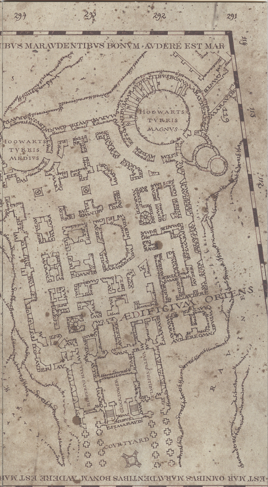
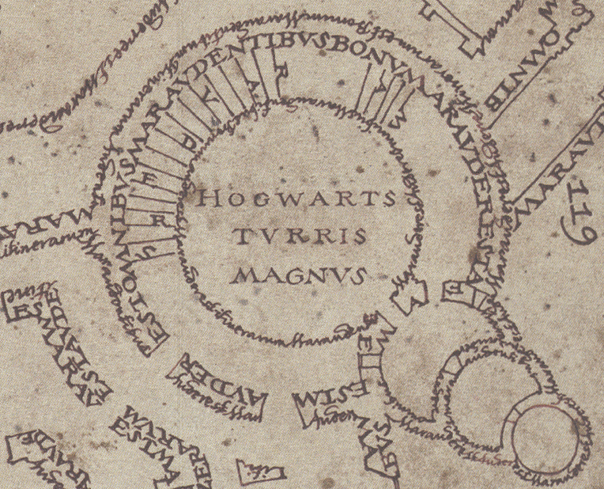
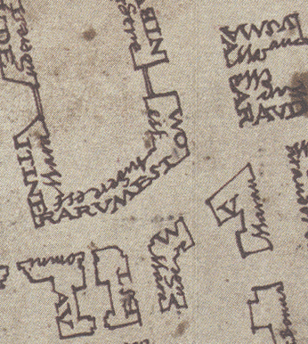
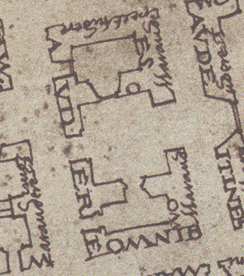

# Introduction
Fantasy maps are awesome, and awesome procedural graphics people make them. One of the most iconic fantasy maps is the Marauder's Map from Harry Potter!

# Goal
We would like to develop a tool that procedurally generates a map of a Hogwarts-like campus which shows where everyone inside is walking about.

# Inspiration/Reference
We were primarily inspired by the Marauder's Map from the Harry Potter series.
While looking for reference materials, we came across this Marauder's map someone created for a themed Halloween party:
https://cartland.medium.com/building-a-marauders-map-6552fa378cda

Important features that we want:

Walls made of text. A roughly rectangular but overall non-uniform footprint

Circular towers and curved hallways around them. Rooms in concentric rings. Possible change in level of detail at different zoom levels.

Not just block rooms -- some slanted hallways

Rooms that go into other rooms, not just into hallways

# Specification

# Techniques
## Building creation
- Shape grammars for overall generation

# Design

# Timeline

  
Timeline

<h4>Milestone 1:</h4>
<ul>
    <li>Nick & Nadine</li>
    - Research Shape grammars
    - Generate basic Hogwarts Castle room/doorway structure and navigation mesh for Insha
    <li>Insha</li>
    - Basic path-finding 
    - Footstep animation (trailing footsteps disappear as more appear)
</ul>

<h4>Milestone 2:</h4
<ul>
    <li>Nadine</li>
    <li>Nick</li>
    <li>Insha</li>
</ul>

<h4>Milestone 3:</h4>
<ul>
    <li>Nadine</li>
    <li>Nick</li>
    <li>Insha</li>
</ul>>